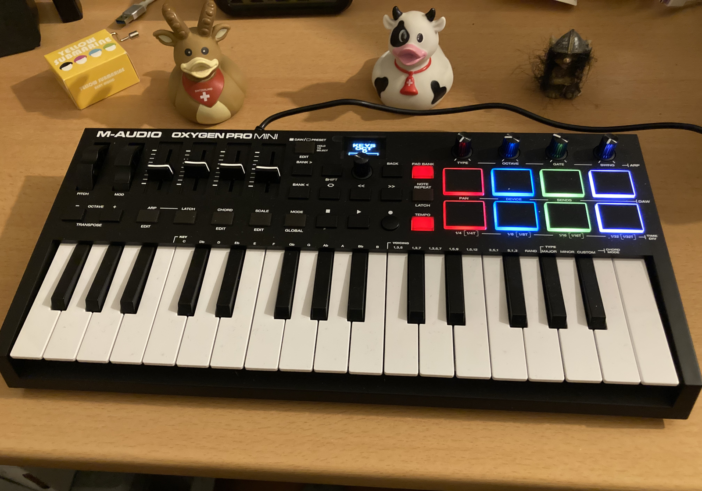
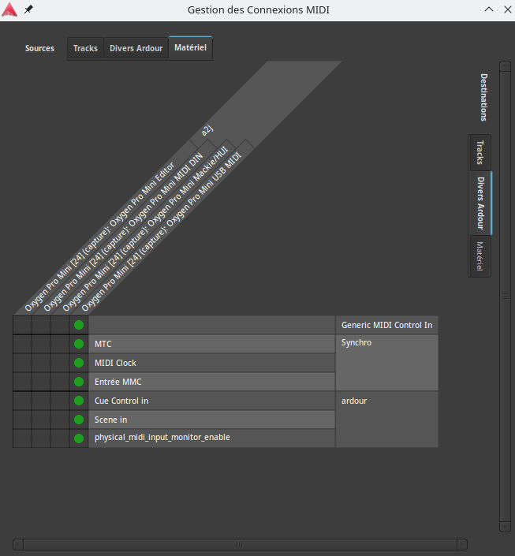

Il y a quelques semaines, j'ai fait une petite acquisition pour me simplifier la vie dans mes compositions.

Jusqu'ici, j'utilisais mon gros clavier arrangeur Yamaha en clavier maître pour piloter Ardour. Cependant, celui-ci ne passe pas sa vie à côté de l'ordinateur et surtout il est surtout fait pour jouer de la musique, et pas vraiment pour faire du contrôle MIDI. Il lui manque plein de choses comme surtout les roues de modulation et pitch, et des boutons de transport pour contrôler mon DAW.

Bref, comme on dit, un bon ouvrier, pour travailler, a besoin de bons outils. J'ai donc fait l'acquisition d'un petit clavier (car je n'ai pas beaucoup de place sur mon bureau) avec un minimum d'éléments pour bien bosser.

Il est class-compliant, donc simplement en le branchant on a de quoi jouer des notes, utiliser les sliders et les potards. Par contre, sans doute car je suis un gros noob, j'ai mis un temps fou à trouver comment faire pour que mon DAW, Ardour 7, puisse gérer les boutons de transport. 

En fait, c'est relativement simple mais il faut aller dire à Ardour de faire la connexion manuellement.

Donc note pour moi-même quand j'aurai oublié : ça se passe dans _Fenêtres_ / _Connexions MIDI_ et il faut bien assigner le clavier vers _Entrée MMC_ pour que ça marche.

Il me reste encore à comprendre pourquoi je dois refaire cette assignation chaque fois que je sélectionne une nouvelle piste, mais c'est déjà bien plus confortable.

Plus d'infos plus tard sans doute.