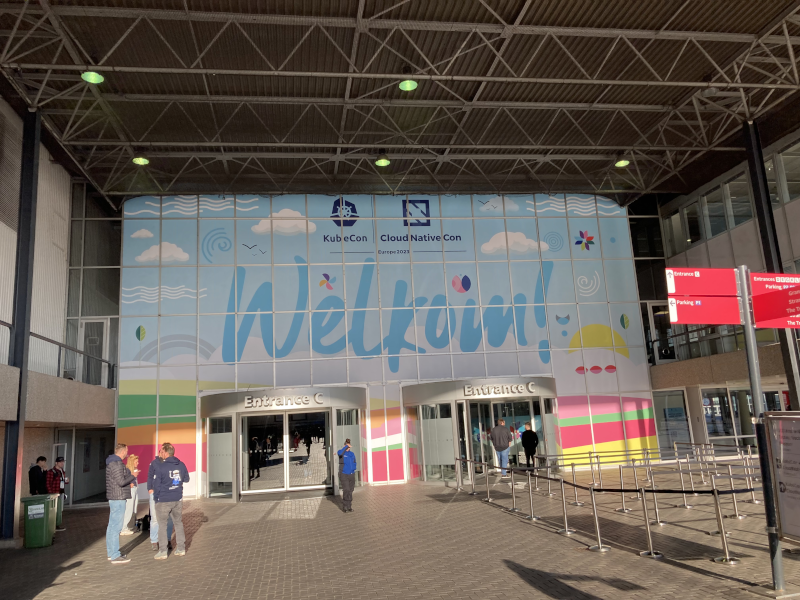
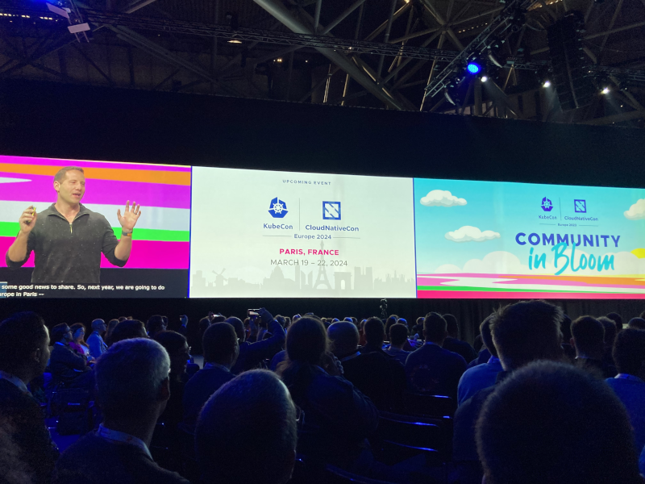
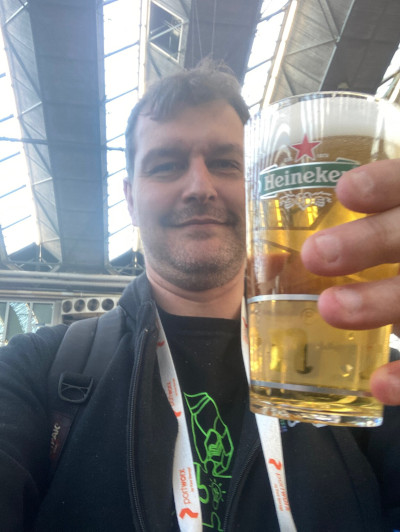

Cet article fait partie d'une suite d'articles concernant la KubeCon+CloudNativeCon Europe 2023:
* Jour 1 (vous êtes ici !)
* [Jour 2]()

Cette année, j'ai la chance de pouvoir assister pour la première fois à la grand messe européenne de la CNCF : la KubeCon+CloudNativeCon Europe 2023.

Celle-ci a lieu cette année à Amsterdam, au RAI convention center.

# Keynotes

Beaucoup d'annonces concernant la CNCF, mais, chauvin comme je suis, j'ai surtout retenu que la prochaine édition de la KubeCon+CloudNativeCon Europe aura lieu à Paris en mars 2024 !

Sinon, outre les updates sur différents projets de la CNCF, quelques sponsors sont venus présenter des projets. 2 thématiques sortent du lot : le durable (avec les projets Kepler de Redhat et KEDA de Azure) et la gouvernance (avec la présentation d'un template de projet CNCF avec plein de guidelines pour un meilleur accueil des contributeurs)

# Les talks auxquels j'ai pu assister

Il y a énormément de talks en parallèle. Il fallait choisir parmi plein de titres alléchant. Voici ce que je suis allé voir. Sans surprise, je me suis tourné principalement vers des sujets autour de l'observabilité, mais pas que.

## It Is More Than Just Correlation - A Debug Journey (par Simon Pasquier & Vanessa Martini, Red Hat)

Un talk intéressant pour présenter un projet tout récent : [korrel8r](https://github.com/korrel8r/korrel8r).
Son but est, à partir d'une liste de règles, de permettre de faire de la corrélation entre les alertes, les métriques, les logs,... afin d'aider le SRE à trouver la root cause d'un incident plus rapidement.

Le projet est encore très jeune (l'UI le montre), mais à surveiller car cela peut être une aide intéressante si le projet va au bout de son idée.

## Past, Present, and Future of eBPF in Cloud Native Observability (par Frederic Branczyk, Polar Signals & Natalie Serrino, New Relic)

Un très bon récapitulatif de l'histoire de eBPF, depuis le premier papier sur BPF à nos jours, suivi d'une explication de ce que permet de faire cette technologie ainsi que ses limitations.

Des démos éclairs de Pixie et Parca viennent étayer le propos.

Hélas, le manque de temps n'a pas permis d'aller très loin dans la partie prospective. Dommage !

## Understand Systems with OpenTelemetry: A Hybrid Telemetry Data Backend (par Ran Xu, Huawei & Xiaochun Yang, Northeastern University)

Difficile après le repas de rentrer dans cette description très détaillée de OpenGemini, un moteur d'indexation de logs et de métriques, compatible OpenTelemetry.
Les perfs annoncées sont pourtant alléchantes, mais le speaker m'a rapidement perdu (pas forcément de sa faute).

## Availability and Storage Autoscaling of Stateful Workloads on Kubernetes (par Leila Abdollahi Vayghan, Shopify)

Un retour d'expérience très intéressant sur la manière de gérer l'augmentation et **surtout** la diminution de la taille de volume montés dans un stateful set Kubernetes (dans le cas de Shopify pour des clusters ElasticSearch).
Leur solution est à base d'un custom controller pour gérer leurs clusters via des CRDs. Dommage que le code ne soit pas open-sourcé (encore ?) pour pouvoir y jeter un oeil.

## Multi-cluster observability with service mesh (par Ryota Sawada, UPSIDER)

Comment gérer la remontée de métriques dans un Thanos quand on est en multi clusters Kube ? La réponse est clairement "on peut, mais c'est très compliqué".
Le speaker nous montre sa démarche pour y arriver avec Istio (configuré sur plusieurs clusters en multi-master), l'opérateur Prometheus et le helm chart de Thanos. Dommage que sa démo ait buguée au bout car c'était intéressant.

## Life without sidecars - is eBPF’s promise too good to be true? (par )

La réponse du speaker est très rapidement : les sidecars sont là encore pour longtemps... mais bon, c’est la boîte qui est derrière Linkerd qui le dit, donc un peu de parti pris quand même (je ne dis pas qu'il a tort, mais juste qu'il n'a pas forcément un regard objectif).

Il en profite pour expliquer pourquoi il pense que eBPF n'est pas la panacée.

Et comme ça ne suffisait pas, il fait aussi le tour des autres approches (sans les nommer mais bon... Traefik mesh a dû avoir les oreilles qui sifflent) pour dire que ce n'est pas non plus la bonne solution.

Le talk est donc très *opinionated* et donne une saveur de boîte qui se sent menacée et veut discréditer ses concurrents à tout prix. Pas très agréable et limite risible. (Encore une fois, je ne dis pas qu'il a raison ou tort, juste que la démarche le discrédite).

# Et c'est tout pour ce jour 1...

... et c'est déjà pas mal, non ?

La suite demain. Cheers !

