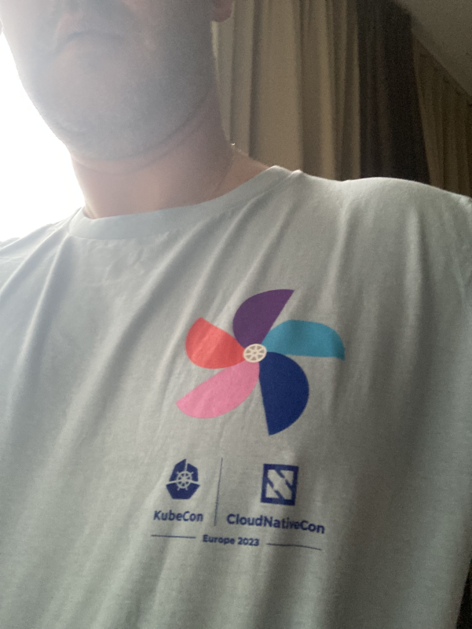

Cet article fait partie d'une suite d'articles concernant la KubeCon+CloudNativeCon Europe 2023:
* [Jour 1]()
* Jour 2 (vous êtes ici !)
* [Jour 3]()

Pour ce jour 2, je me suis équipé du T-shirt officiel de l'événement que je trouve très réussi. Bravo à l'organisation !

# Keynotes

Outre les annonces de ce qu'il s'est passé dans les projets de Kubernetes et les projets incubating, un talk très intéressant d'Emily Fox sur le knowledge management dans les projets open-source, en faisant la comparaison avec les glaciers (pour symboliser l'accumulation des savoirs et leur conservation dans le temps) et avec les jardins (comment cultiver les savoirs et faire en sorte que cela soit pérenne dans le temps). Très joli talk qui a touché ma fibre écolo.

# Les talks auxquels j'ai pu assister

J'ai essayé de varier un peu plus aujourd'hui

## Story of our transition to a custom kubernetes operator for an API gateway (par Vincent Behar, Ubisoft)

Vincent nous a présenté la vision d'Ubisoft en terme de platform as a service pour les développeurs d'Ubisoft, ainsi que les besoins en terme de sécurité que cela implique pour eux.

Ils ont une API gateway basée sur Kong, et ont développé un opérateur custom dans leur cluster pour permettre à leur développeur de déclarer facilement le routage, les règles d'authentification, etc... pour les synchroniser vers Kong.

Le speaker nous explique en détail leur démarche, pourquoi ils sont partis sur du custom plutôt que d'utiliser (en les tordant) les alternatives existante (Ingress API, Gateway API, Kong ingress controller,...) sans passer sous silence les challenges que cela supposent (en terme de maintenance et de potentiel montée de version de l'API).

Un talk très intéressant, d'autant qu'il met l'accent sur la developer experience ainsi créée.

## Use Knative when you can, Kubernetes when you must (par David Hadas & Michael Maximilien, IBM)

Je ne suis pas vraiment un fan de tout ce qui est serverless, mais là, ils m'ont accrochés sur 2 points :
* D'abord en mettant en avant la simplicité d'autoscaling sur des services "natifs" (qui répondent aux 12 factors en gros)
* Le Knative security guard qui vient se plugguer sur le queue proxy pour bloquer des comportements non-attendus.

On peut en plus s'appuyer sur le système d'événements de Knative si on bosse en *event-driven*. Que demande le peuple ? 

Il va falloir que je creuse un peu si ce ne serait pas plus simple de mettre la plupart de nos workloads ainsi.

Je suis hypé !

## Unlocking the potential of KEDA: new features and best practices (par Jorge Turrado Ferrero, SCRM Lidl International Hub & Zbynek Roubalik, Red Hat)

En parlant de hype, j'avais envie d'en savoir un peu plus sur [KEDA](https://keda.sh/).

C'est un auto-scaler qui permet de s'appuyer non pas uniquement sur le CPU et/ou la mémoire comme en natif, mais sur des événements/métriques externes.

Le use-case qui m'intéresse est dans le cas d'une *event-driven architecture*, dans laquelle le nombre de messages à traiter est plus important que les métriques standards.

La description du projet est claire et donne envie d'aller clairement plus loin.

Dans les nouveautés notables :
* La réduction du nombre de connexions aux sources externes en faisant tout transiter sur le controller
* La mise à dispo de métriques Prometheus

## Minimizing Energy Consumption in Bare Metal K8s Clusters (par Marco Schröder & David Meder-Marouelli, 1&1 Mail & Media)

Retour d'expérience intéressant sur comment 1&1 Mail & Media a essayé de prendre le sujet de la réduction d'énergie à bras le corps.

Ce qui intéressant dans ce talk, c'est de voir leur démarche, les réflexions qu'iels ont eues. Les conclusions sont certes intéressantes, mais hélas pas de remède magique.

Je retiens surtout qu'il vaut mieux éteindre des noeuds kubernetes non utilisés ou peu utilisés car leur consommation est non nulle du fait d'avoir les outils de k8s (kubelet, ...) qui tournent quelque soit la charge. Cela demande évidemment une automatisation forte de l'installation d'un noeud bare-metal.

A noter que des petits gestes peuvent aussi aider. Leur exemple&nbsp;: diminuer légèrement la vitesse de rotation des ventilos peut réduire la consommation d'un serveur de 15W, mais à l'échelle de l'infra cela représente 10MWh par mois... ça se prend.

Je pense que je regarderai sûrement le replay car cela mérite un second regard.

# Et voilà pour ce jour 2 !

Suite et fin demain.
