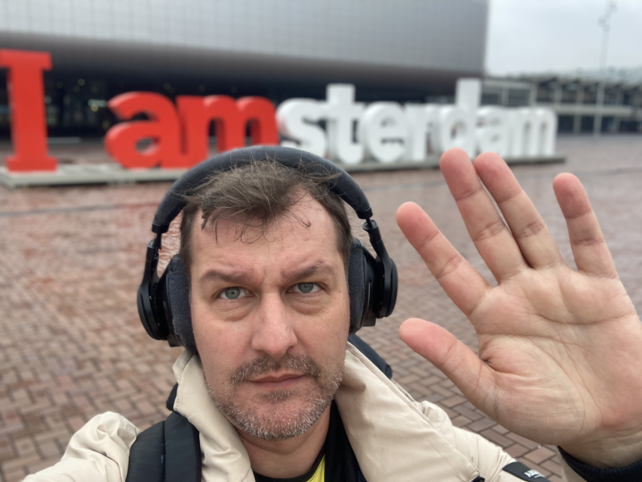

Cet article fait partie d'une suite d'articles concernant la KubeCon+CloudNativeCon Europe 2023:
* [Jour 1]()
* [Jour 2]()
* Jour 3 (Vous êtes ici !)

# Keynotes

La thématique de départ était sur la sécurité avec un talk sur la notion de confiance ("Trust no system").

Un talk a retenu mon attention : celle de Cisco sur Media Streaming Mesh, qui permet de gérer du streaming de vidéo en temps réel 
dans Kubernetes. Le speaker a bien posé les enjeux et les solutions possibles. Ce ne me concerne pas directement aujourd'hui, 
mais sait-on jamais de quoi l'avenir peut être fait, pas vrai ?

Les dates des prochaines KubeCon ont été rappelées :

* KubeCon China à Shangai - 25-27 septembre 2023
* KubeCon North America à Chicago - 6-10 novembre 2023
* Et bien sûr KubeCon Europe à Paris - 19-22 mars 2024

# Les talks auxquels j'ai pu assister

## What could go wrong with a GraphQL query and can OpenTelemetry help? (par Sonja Chevre & Ahmet Soormally, Tyk)

Clairement, avec GraphQL et OpenTelemetry dans le même titre, je ne pouvais pas faire l'impasse sur ce talk.

Et c'était intéressant : après un rapide rappel de ce qu'est GraphQL, de ce que sont les métriques RED, on se confronte à un contexte
qui me rappelle un peu des choses que j'ai pu rencontrer.

On fait l'instrumentation basique au début, et de manière itérative on essaie d'avancer sur des problématiques concrètes afin d'améliorer
petit à petit. Et comme ce n'est pas une science exacte, c'est évidemment à affiner chacun en fonction de ses besoins.

L'important finalement est de bien remplir vos spans, car c'est la base de votre instrumentation (on peut laisser le connecteur OTel générer les métriques Prometheus ensuite).

Un talk plaisant en tout cas.

## Connected Observability Pipelines in the OpenTelemetry Collector (par Dan Jaglowski, observIQ)

Derrière ce nom mystérieux se cache un talk très intéressant sur l'utilisation des connecteurs dans le collector OpenTelemetry. Cela permet de contourner des limitations des data pipeline de base en se plaçant à la fois comme receiver et comme exporter.

Ainsi, on peut faire du routage de log, gérer de multiples targets avec des règles différentes (comme par exemple exporter des logs samplées à un endroit, et envoyer l'intégralité ailleurs assez facilement), voire même utiliser un type de données (par exemple les logs) pour alimenter un outil avec un autre type de données (par exemple des métriques en faisant un count par exemple).

Tous les connecteurs ne sont pas encore disponibles, mais certains le sont déjà. Et ça c'est cool ! Ca ouvre un tas de possibilités.

## Sustainability Through Accountability in a CNCF Ecosystem (par Yuval Lifshitz & Huamin Chen, Red Hat)

En partant du constat classique que 2.5% du CO2 vient des data centers et que c’est en forte croissance, il est important de savoir mesurer la consommation énergétique de nos workloads.

Pour cela, les 2 speakers présentent Kepler, qui permet de mesurer la consommation à partir d'info systèmes (en se basant sur eBPF) et d'un modèle d'analyse.

On peut ensuite récupérer ces métriques dans Prom. Et à partir des traces OpenTelemetry, avec l’info de quel pod a été mis en jeu dans les spans, on peut aussi faire une estimation du coup pour une requête/user.

Très intéressant.

## Effortless Open Source Observability with Cilium, Prometheus and Grafana - LGTM! (par Raymond de Jong & Anna Kapuścińska, Isovalent)

Isovalent est la société derrière Cilium, et leur objectif ici est de montrer l'observabilité de la stack CNI/Service mesh que composent Cilium et Hubble.

La problématique à traiter est quelque chose que l'on connaît trop bien : quand 2 applications n'arrivent pas à comuniquer, pour les devs applicatifs c'est de la faute du réseau, et pour l'équipe réseau... ben... tout va bien.

Leur démo de Cilium et Hubble, leur intégration avec Grafana (notamment leur plugin pour Hubble) est bluffante, et le fait que des exemplars sont créés pour les erreurs car Cilium arrive à choppé les headers pour les traces est juste excellent.

J'ai hâte de pouvoir aller y mettre le nez (car je devrais potentiellement avoir cette opportunité rapidement).

## Future of Service Mesh - Sidecar or Sidecarless or Proxyless? (par Idit Levine & Yuval Kohavi, Solo.io; Keith Mattix II, Microsoft; Eric Van Norman, IBM; John Howard, Google)

Il s'agissait d'un panel autour principalement de Istio, promouvant le mode Ambiant mesh qui est sans sidecar (enlevant les problématiques asociées).

Contrairement à Linkerd, pour eux, l'avenir est sans sidecar, eBPF est surtout une hype comme les cryptocurrencies (mais tout n'est pas à jeter dedans évidemment).

Concernant le proxyless, cela veut principalement dire déplacer la logique dans l'application elle-même. On y perd en transparence vu de l'application, le gain est au niveau des performances car on enlève l'overhead dû au proxy.

Je ne maîtrise pas trop le sujet, donc je ne vais pas m'apesantir. J'ai trouvé intéressant d'avoir un autre point de vue très orienté... A chacun de nous de se faire son opinion.

# Voilàààààààààààà, c'est fini !

On est toujours un peu triste quand ce genre d'événement finit. Mais on en sort avec plein d'idées, plein d'envies, plein de bonnes résolutions (contribuer plus, présenter des talks plus souvent,... et arrêter de manger autant et de boire autant de café pendant les pauses !)

Je ne résiste pas à l'envie de faire la blague parce que bon... j'aime les blagues, voilà c'est dit !

Et donc, en France, nous sommes Charlie, mais ici...

(drop the mic)