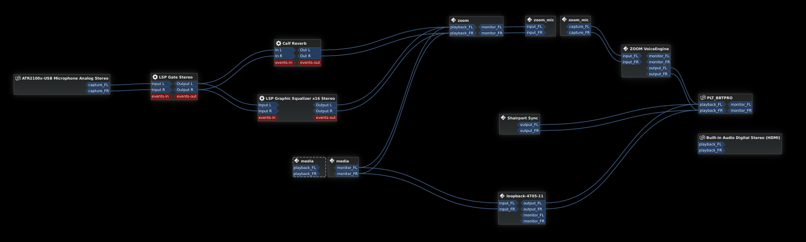
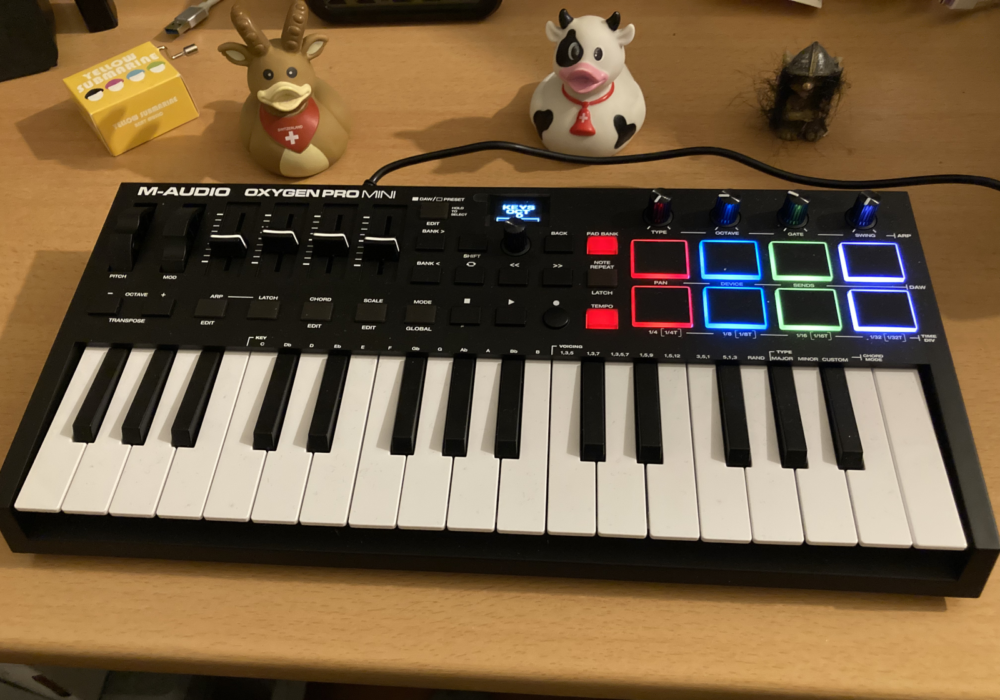

# Mon petit vice

Comme [je l'ai déjà écrit par le passé ailleurs sur le web](https://zibok.medium.com/send-arbitrary-audio-along-with-your-mic-sound-using-pulseaudio-2df95d05a7cd),
j'adore balancer des sons de manière inopinée dans mes réunions. C'est d'autant plus vrai maintenant que je suis majoritairement
en télétravail et que j'utilise de la visio très régulièrement. Pour cela, je me suis paramétré mon serveur de son sous Linux
pour simuler un micro qui mixe mon micro et une sortie dans laquelle j'envoie mes sons.

Depuis cet article, je suis passé à Pipewire comme serveur de son, mais, globalement, le système reste similaire.



# Et v'la le contrôleur !

Dans [un autre article](),
je vous faisais part de mon acquisition d'un petit clavier maître MIDI pour ma passion musicale naissante.



Et du coup, toutes ces touches et ces pads ont fait qu'à un moment 2 fils se sont touchés dans mon cerveau (ça m'arrive souvent)
et je me suis dit "pourquoi ne pas profiter de tous ces boutons pour enquiquiner encore plus facilement le monde :D ?"

# Pas de solution out-of-the-box sous Linux

Avant de me lancer dans un développement, comme tout bon ingénieur qui se respecte, j'ai commencé par vérifier que rien n'existait
en open-source pour faire ça sous Linux.

Etonnamment, il y a plein de choses qui existent pour faire une soundboard, mais peu de solutions supportant nativement les commandes MIDI.

J'ai eu un espoir en regardant [Soundux](https://soundux.rocks/), mais malheureusement [le support MIDI a été revert l'an dernier](https://github.com/Soundux/Soundux/commit/085abaa50b96d395df1a37a0422087f52d671a1b).

J'ai vu également [un truc très bien fait en mode web fait par Tim Franssen](https://timendus.github.io/soundboard/) qui fait ce que je veux...
mais à condition de devoir le reparamétrer à chaque fois (et j'avoue que j'ai un peu la flemme).

# Alors on bricole un truc dans son garage

En attendant de me lancer dans un vrai développement sérieux avec un vrai langage, je me suis dit qu'avec un peu de bash, on devrait pouvoir s'en sortir.

Je m'appuie sur un outil MIDI basique qui s'appelle `aseqdump` qui permet de suivre les commandes MIDI qui passent sur un port.
Ainsi, en lançant la commande 
```
aseqdump -p "Oxygen Pro Mini"
```
je peux suivre les commandes envoyées par mon clavier. Ca donne un résultat du genre

```
Waiting for data. Press Ctrl+C to end.
Source  Event                  Ch  Data
 28:0   Note on                 9, note 40, velocity 77
 28:0   Note off                9, note 40, velocity 0
 28:0   Note on                 9, note 37, velocity 54
 28:0   Note off                9, note 37, velocity 0
 28:0   Note on                 0, note 50, velocity 103
 28:0   Note on                 0, note 48, velocity 99
 28:0   Note off                0, note 50, velocity 0
 28:0   Note off                0, note 48, velocity 0
 28:0   Note on                 0, note 57, velocity 93
 28:0   Note off                0, note 57, velocity 0
 28:0   Note on                 0, note 62, velocity 91
 28:0   Note on                 0, note 64, velocity 83
 28:0   Note off                0, note 64, velocity 0
 28:0   Note off                0, note 62, velocity 0
```

A partir de là, avec un peu de traitement de texte et un outil en CLI pour lire du son (j'utilise le basique `pw-play` de Pipewire),
on arrive à faire ce qui nous intéresse.

Le résultat est dans mon Github https://github.com/zibok/minimalistic-midi-soundboard et ça fait le job.

# Ce que ça ne fait pas

Vu que c'est du bash, évidemment c'est très très (très) basique.

* On ne peut pas stopper facilement un son une fois lancé (ça ne gère pas l'événement Note off)
* On ne peut pas retrigger un autre son tant que le précédent n'est pas fini

Mais bon, c'est un premier jet :)

Peut-être une version moins basique plus tard.

Enjoy!
