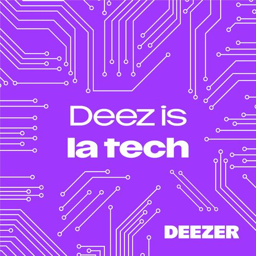

Vous le savez sans doute déjà, mais j'ai pour habitude de co-animer chaque mois le podcast [Deez Is La Tech (DILT)](https://podcastindex.org/podcast/5729644) avec [l'ami Loïc Doubinine](https://mamot.fr/@ztec).

# Le code a changé

Eh bien exceptionnellement ce mois-ci, les animateurs sont les invités ! Nous avons pu parler de notre métier de SRE, accompagné de notre éminent collègue [Denis Germain](https://framapiaf.org/@zwindler). Tout ce beau monde interviewé par [Pauline Munier](https://twitter.com/_Miss_Clark_/) (celle sans qui tout ça ne serait pas possible, enfin derrière le micro !) et [Stéphane Bachelet](https://sciences.re/@stephanlabiz).

Alors, on va le dire tout de suite, une heure c'est court pour tout aborder donc on a oublié des choses. Mais nous avons essayé de dresser un panorama de ce qu'est le Site Reliability Engineering et ce qu'est, pour nous, le métier de SRE. Un point de vue éclectique car nous n'avons pas tous le même parcours, et nous avons donc des vécus différents.

Ce fut un plaisir de partager ce qui fait mon quotidien avec les auditeurs.

# Mais où trouver cette merveille ?

Du calme mon jeune ami, les liens arrivent !

* **L'épisode du podcast** : [sur Deezer](https://deezer.page.link/svHKRDwnr7kfUp337) | [sur Acast](https://shows.acast.com/632c77d9a2a9bf001245558b/6553a9a9633f520012d3bbaf) (il est évidemment aussi disponible sur toutes les bonnes plateformes)
* **[L'article de blog associé](https://deezer.io/deez-is-la-tech-s02e02-en-t%C3%AAte-%C3%A0-t%C3%AAte-avec-des-sre-missions-quotidien-et-challenges-7a45e4bdd1f3)** avec le transcript, les références et les coups de coeur musicaux de tout le monde