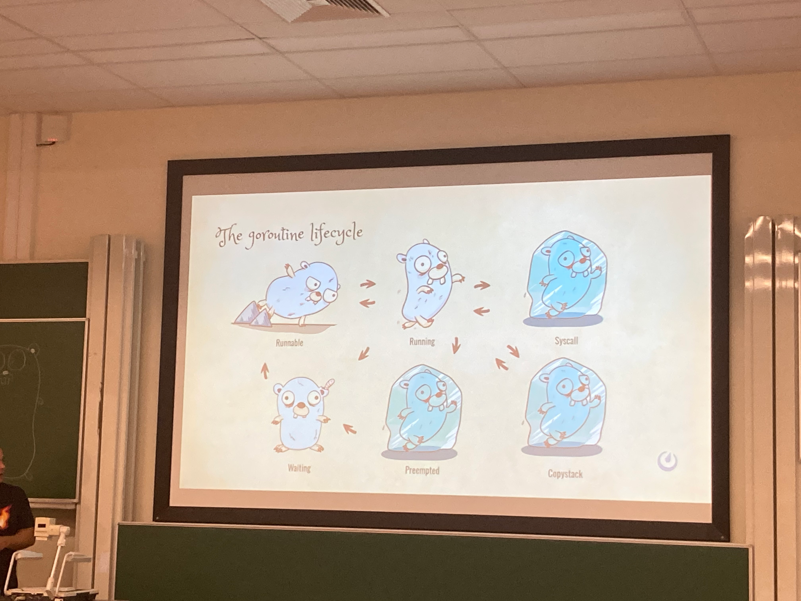

Comme chaque année en février, Bruxelles devient la capitale européenne du logiciel libre.

Le [FOSDEM 2024](https://fosdem.org/2024/) a lieu comme à l'accoutumée sur le campus de l'ULB (Université Libre de Bruxelles) et regroupe un nombre démentiel de participants.

Pas moins de 61 tracks sur le week-end, autant vous dire que je ne pourrai pas être partout ^^'.

Voici mon récap de ce premier jour, avec de vrais morceaux de Go dedans :D

# The state of Go - Maartje Eyskens

10e édition !

3-4 petits breaking changes, et quelques petits ajustements au langage (notamment le `for i:= range 10`)

`http.ServeMux` gère plus d'options et notamment les paramètres dans les URLs et la limitation sur la méthode HTTP (GET, POST,...)

Et merci les génériques pour simplifier la gestion des slices et des maps 😗

Une nouvelle expérimentation est en cours sur l'interface RangeFunc (un peu un genre de Iterable pour ceux qui raisonnerait avec PHP).

L'occasion malheureusement d'apprendre la mort de Gophers emblématiques comme [Kris Nóva](https://krisnova.net/bio/) (qui était présente l'an dermier pour présenter Aurae et Hachyderm, un talk magnifique). Une lourde perte pour la communauté.

# The secret life of a goroutine - Jesus Espino

Un talk très détaillé sur l'ensemble des états et transitions dans le cycle de vie d'une goroutine, et comment le scheduler gère ça.

Le résumé (en photo)

Très intéressant si on s'intéresse aux entrailles du runtime de Go.

# You're already running my code in production: My simple journey to becoming a Go contributor - Jonathan Hall

Jonathan nous présente ce qu'il a vécu pour sa première contribution à Go lui-même. Son parcours depuis la proposition, la discussion qui s'en suit, le fait qu'il a pu codé ce qu'il a proposé et les enseignements qu'il en a tiré. L'objectif étant de démystifier ce que veut dire contribuer à un langage comme Go.

Ce que j'en retiens:
* Regarder les guidelines de contribution car l'équipe peut être UN peu picky, mais ça évite des aller-retours sur des broutilles
* Ca prend du temps sur la proposition et sur la validation du code, mais ça doit être grisant de se dire qu'on a contribué à un tel repository

# Single binary, full-stack provisioning - James Shubin (purpleidea)

Une démo un peu folle de [mgmtConfig](https://mgmtconfig.com/) en live : le provisionning d'un RPi sur Fedora en unattended depuis le boot (PXE) jusqu'à l'installation complète.

Ultra speed et démo qui fail à la toute fin hélas, mais concept intéressant et performances assez impressionnantes !

# Efficient Integration Testing in Go: A Case Study on Dapr - Josh van Leeuwen

Josh repart de la base théorique des tests (pourquoi on teste, différents types de test, la pyramide des tests) et nous explique comment les tests du projet Dapr sont organisés pour être le plus efficace possible.

J'avoue que j'ai un peu décroché à un moment, un replay que je me ferai très certainement une fois rentré.

# L'instant sustentation

Petit moment de repos pour les méninges, en mangeant sainement évidemment. Et végétarien bien sûr ! 

# Dependency injection: a different way to structure a project - Dylan Reimerink

Dylan travaille chez Isovalent, la société derrière [Cilium](https://cilium.io/) (si vous ne savez pas ce que c'est, ça vaut le détour, et j'en ai parlé dans mon report de la KubeCon Europe 2023).

Il présente les problématiques réglées par l'injection de dépendances (en Java ou en PHP/Symfony ça se fait beaucoup, mais, en Go, ce n'est pas encore une habitude).

Il utilise `go.uber.org/fx` pour ça. Ce qui est intéressant, c'est que la lib permet de gérer le cycle de vie des objets dans les constructeurs (OnStart, OnStop,... pour un Server par ex).

`fx` propose aussi un système de groupes, mais à utiliser avec parcimonie. Pratique pour injecter des choses standards (ex: config, metrics,...) à plusieurs endroits. C'est juste moins explicite qu'avec des `Provides`/`Invoke`.

A voir si c'est mieux que `wire` de Google (qui m'a laissé un peu déçu par le passé).

# Putting an end to Makefiles in go projects with GoReleaser - Denis GERMAIN

**Disclaimer:** je ne vais pas être objectif, car Denis est un collègue. Vous le connaissez peut-être pour [son blog](https://blog.zwindler.fr). Et vous le connaissez sans doute parce que nous avons fait [un épisode de Deez is la tech](tech/2023-03-08-deez-is-la-tech) ensemble 😄

Denis est historiquement un "ops" qui s'est mis au développement Go, et qui a découvert [GoReleaser](https://goreleaser.com/) pour gérer la mise à disposition de ses artefacts de release.

On notera surtout la puissance de l'Open Data en France qui recense l'ensemble des salons de coiffure avec des jeux de mot (par exemple "Défini'tif")

Et la démo a marché. Chapeau bas 👏🏽 !

# Ingesting and analyzing millions of events per second in real-time using open source tools - Javier Ramirez

Première conf non-Go de la journée, mais ça parle Kafka !

On parle ici de streaming de données. On commence par un historique de ce qu'était un pipeline de données, depuis une db vers un CSV, vers des pipelines plus complexes (avec de l'ingestion temps réel et de la restitution en temps réel aussi)

Javier nous présente ensuite son template, si on part de zéro, pour construire une data platform. Avec Kafka, Kafka connect, QuestDB (la société qui emploie le speaker 😉), Telegraf, Grafana, Jupyter Notebooks et une partie forecast modeling et data exploration (avec Python Pandas, Polar et Facets)

[https://github.com/questdb/time-series-streaming-analytics-template]

QuestDB est une db orientée timeseries, que l'on peut utiliser depuis Grafana. Ce template envoie les données de métrique dans QuestDB notamment. Les temps de réponse ont l'air d'être intéressants, mais toujours faire ses benchmarks soi-même ;)
A première vue, QuestDB se requête comme un PostgreSQL, ça ouvre pas mal de perspectives d'interopérabilité.

# Will the first Artificial General Intelligence (AGI) instance be free or open-source software? - Pieter Libin

AGI = IA à but généraliste, donc quelque chose qui va bien plus loin que les LLM auquel la science a abouti jusqu'ici.

Une présentation académique par ce professeur du labo VUB sur l'IA. Difficile de répondre à cette question car cela va dépendre de la volonté des sociétés travaillant sur les technologies d'IA de partager leurs travaux sur le plan scientifique (code, données servant à l'entraînement, démarche,...).

Une réflexion intéressante sur les impacts sociétaux qu'un AGI qui ne prendrait pas en considération les aspects humains et sociaux pourrait avoir.

# Fin du jour 1

Ce fut une journée riche, et un peu la tête en mode 🤯. Petite soirée bière comme il se doit à Bruxelles, et on repart pour de nouvelles aventures demain ! (Normalement, on devrait parler monitoring et observabilité si tout va bien).