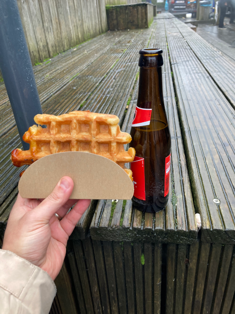

Cet article fait partie d'une série d'articles concernant le FOSDEM 2024.
* [Jour 1]()
* Jour 2 (Vous êtes ici ! 🎯)

Pour cette seconde journée, nous allons parler principalement de monitoring et d'observabilité.

# Welcome to the Monitoring & Observability devroom - Richard "RichiH" Hartmann

8e devroom sur le sujet. La thématique annoncée pour cette année est moins sur la révolution mais plus sur de l'évolution et comment appliquer les technos qui ont émergées ces dernières années sur les workloads que l'on peut rencontrer couramment dans nos entreprises.

# Auto Instrumentation for your NodeJS Application on Kubernetes - Yuri Oliveira Sa

On commence par un rappel de l'architecture d'OpenTelemetry (receivers, les collectors composés de processors et exporters,...).

Yuri présente l'utilisation de l'opérateur OpenTelemetry et l'utilisation des CRD `OpenTelemetryCOllector` et `Instrumentation`.

Il suffit d'ajouter une annotation sur les pods et l'instrumentation automatique est injectée dans le pod sans même avoir à modifier l'application. (Par contre, si vous avez besoin d'ajouter des spans par exemple, ben... faudra modifier l'application évidemment).

# When Prometheus Met OpenTelemetry - Pavol Loffay

L'objectif de cette présentation est de montrer que passer de Prometheus à OpenTelemetry n'est pas chose facile du fait des différences de conception, notamment pour les metrics en delta temporality.

Démo : montrer les diffs entre une exposition Prometheus simple d'une app Go puis ce qui revient après passage dans le collector.

En gros, pour résumer ma compréhension, on en conclut un peu ce qui pourrait paraître logique : mieux vaut exporter en OTLP depuis les applications pour ensuite laisser le collector exporter vers Prometheus vs. utiliser le receiver Prometheus pour faire une conversion vers Prometheus ensuite (ou garder le scrape direct évidemment). Les impacts sont loin d'être neutres même si un `TargetAllocator` peut aider à conserver une partie des labels sur les timeseries (et éviter de faire des jointures complexes avec les timeseries `target_info`).   

# Strategic Sampling: Architectural Approaches to Efficient Telemetry - Benedikt Bongartz, Julius Hinze

Plusieurs stratégies possibles :
* **head-based sampling** : décision prise au début de la trace (mais on ne peut pas prendre en compte le statut de la trace - error ou pas par exemple - dans le sampling)
* **tail-based sampling** : décision prise à la fin de la trace (mais demande un surcoût car la décision doit être prise avec tous les spans de la trace + peut être gênant pour les long-running process si la décision est prise au bout d'un temps donné par exemple)

L'objectif de cette démo est de montrer comment on peut essayer d'utiliser le tail-based sampling à l'échelle. Pas mal d'idées, avec du load-balancing basé sur du consistent hashing, en mettant un Kafka topic par pod au milieu aussi, mais c'est vraiment un problème compliqué à résoudre.

Un talk super intéressant sur un use-case pourtant très classique.

# Practical CI/CD Observability with OpenTelemetry - Dimitris Sotirakis, Giordano Ricci

Pas dans la même salle (puisqu'il s'agit de la devroom Testing & Continuous delivery), mais un peu le même sujet quand même finalement 😃

On commence par la traditionnelle question "C'est quoi la CI ?" (ça doit être le "peut-on rire de tout ?" des informaticiens 😅).

L'idée du talk est de dire que l'observabilité se concentre pour le moment sur la partie run, et peut-être faudrait-il faire un "focus-shift" vers la partie "test & deploy".

Et donc... remonter les données de métrologie des environnements de CI et des builds via un collector OpenTelemetry.
Dans leur cas, ça veut dire créer un receiver pour leurs environements de CI. Il en existe pour Jenkins et Drone par exemple, et sans doute pour d'autres aussi.

L'objectif est de pouvoir tracer de quel PR provient un test devenu flacky par exemple, ou suivre la performance des builds, ou encore suivre le code coverage dans le temps (même si des outils comme Sonarqube font dejà ça très bien, mais c'est un talk de Grafana, donc ils poussent leurs solutions 😉)

Point intéressant : un working group a commencé à bosser sur de la sémantique des attributs pour le champ de la CI/CD dans OpenTelemetry. J'imagine que ça ne va pas se faire rapidement, mais c'est bien que ce genre d'initiative existe.

# What’s possible in observability when we have frame pointers - Matthias Loibl, Jon Seager

Retour en dev room "Monitoring & observability".

Les Frame pointers sont les pointeurs qui permettent de connaître la call stack quand on est en train d'exécuter un programme. L'idée est d'utiliser eBPF pour faire du profiling avec un overhead assez bas, et même du debuggage.

Ubuntu 24.04LTS aura les frame pointers actifs par défaut sur les plateformes 64bits. Certains outils comme bpftrace seront installés par défaut (sauf peut-être sur les images minimales).

Je n'ai pas les compétences suffisantes pour voir si c'est vraiment intéressant ou pas en production. A voir...

# Modern application observability with Grafana and Quickwit - François Massot

François revient sur le problème de cardinalité qui arrive rapidement sur les métriques (et si vous avez déjà fait un peu de Prometheus dans Kubernetes, vous voyez sans doute ce dont il parle 😄)

Il présente Quickwit, un moteur de stockage pour logs et traces et qui s'appuie sur un object storage.

Comme d'habitude, les temps de réponse ont l'air très intéressants, mais évidemment ça demande de faire du benchmark soi-même pour se rendre compte.

Le pauvre a eu des soucis de vidéo avant son talk, ça n'a clairement pas dû être facile pour lui.

# What is CI/CD observability, and how to bring observability to CI/CD pipelines? - Dimitris Sotirakis, Giordano Ricci

Les mêmes que plus tôt dans la journée, mais dans une autre salle ! 🤔

Eh ben vous savez quoi ? Ils ont redit **exactement** la même chose :joy:

&lt;mode râleur&gt; Je trouve le procédé malhonnête de prendre 2 slots de conf, avec des titres différents, pour présenter **exactement** le même set de slides. Ca fait un sujet de moins qui aura pu être traité. Bref, c'est naze ! &lt;/mode râleur&gt;

# C'est finito !

C'est sur ce talk énervant que cet édition du FOSDEM. Après l'effort, le réconfort.

Ce fut une édition sympa, faites d'inspiration, de discussions et de bons moments (pas tous alcoolisés hein! Ne soyez pas médisants s'il vous plaît 😅).

Un point important : le FOSDEM est une conférence elle-même open-source, et l'ensemble des replays devraient être disponibles rapidement sur [le site du FOSDEM](https://fosdem.org/2024/). Rendez-vous sur la page de chaque talk pour le trouver dès qu'il est disponible. C'est d'autant plus important que, comme je le disais en préambule du jour 1, il y a un nombre très important de talks sur le week-end, sur des sujets aussi divers que des technologies, des problématiques sociétales autour de l'open-source et des technologies de l'information, des domaines juridiques, etc... C'est sans doute la conférence la plus riche et la plus diverse qui existe à ma connaissance.

Comme toutes les bonnes choses ont une fin, me voilà au moment où j'écris ces lignes dans l'Eurostar du retour pour Paris, la tête pleine d'envie de tester des trucs, d'implémenter ce que j'ai pu voir ce week-end et de lancer des sujets d'amélioration chez mon employeur préféré (bon ok, c'est le seul que j'ai en même temps).

A bientôt pour de nouvelles aventures !
