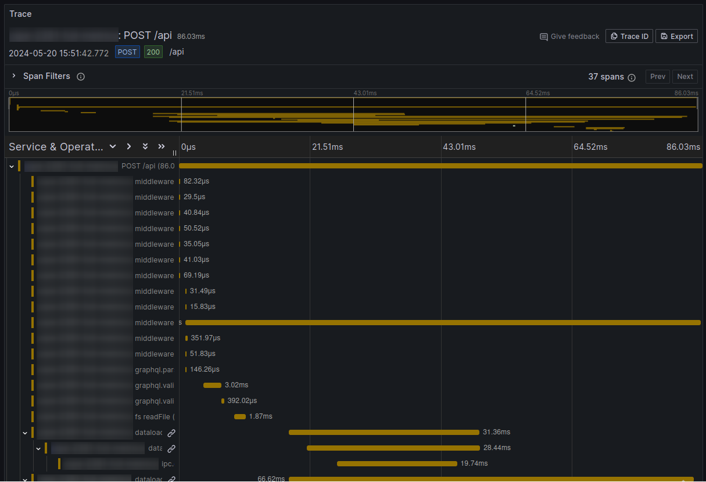
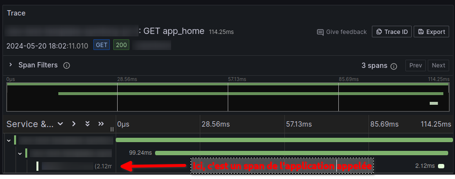

[OpenTelemetry](https://opentelemetry.io/), pour ceux qui ne connaîtraient pas encore, c’est un standard issu de la fusion de OpenTracing et OpenCensus, qui a pour vocation de rendre interopérable les plateformes d’observabilité logicielles.

OpenTelemetry s’occupe de 3 types de signaux : les métriques, les logs et les traces. C’est sur ces dernières que j’expérimente un peu en ce moment et ce sur 3 langages : JavaScript/TypeScript (NodeJS), Go et PHP.

Je n'irai pas plus loin sur ce qu'est OpenTelemetry car il y a masse d'articles et de talks, en français et en anglais sur ce sujet.

L’objectif ici est de déterminer l'effort nécessaire pour passer de 0 à tracing distribué sur les applications écrites sur chacun des langages cités plus haut et tournant sur un cluster Kubernetes hébergé on-premise (point d’AKS, EKS, GKE ou tout autre cluster kubernetes managé ici). On aura juste installé au préalable une solution de stockage des traces (par exemple [Tempo de Grafana Labs](https://grafana.com/docs/tempo/latest/) dans mon cas, mais peu importe, le but étant de pouvoir requêter pour vérifier que l’on a bien les traces avec les spans de toutes les applications traversées par la requête originale).

Autre point, sur le cluster est installé [l’opérateur OpenTelemetry](https://opentelemetry.io/docs/kubernetes/operator/) afin de bénéficier des CRD OpenTelemetry Collector et Instrumentation pour les langages supportés (et donc... pas PHP).

# NodeJS

Sur le papier, si on lit la documentation de l’opérateur, mettre en place du tracing sur une application NodeJS est juste un no-brainer. D'ailleurs, j'en avais vu une démo au [FOSDEM 2024]() et j'en avais l'eau à la bouche.

Cela se résumerait à :
* créer un objet Instrumentation configuré pour NodeJS
```yaml
apiVersion: opentelemetry.io/v1alpha1
kind: Instrumentation
metadata:
  name: nodejs-instrumentation
spec:
  exporter:
    endpoint: http://localhost:4317 # Car je vais utiliser un sidecar, sinon un déploiement de collector OpenTelemetry 
  propagators:
    - tracecontext
    - baggage
```

* ajouter une annotation sur **les templates de pod** des objets deployment de l’application
```yaml
apiVersion: apps/v1
kind: Deployment
spec:
  template:
    metadata:
      annotations:
        instrumentation.opentelemetry.io/inject-nodejs: "nodejs-instrumentation" # si l'objet Instrumentation ci-dessus est dans le même namespace
```

* Et, optionnellement, créer un objet OpenTelemetry Collector si on souhaite que le collecteur soit embarqué en Sidecar des pods de l’application.

```yaml
apiVersion: opentelemetry.io/v1alpha1
kind: OpenTelemetryCollector
metadata:
  name: sidecar-collector
spec:
  mode: sidecar 
  config: |
    receivers:
      otlp:
        protocols:
          grpc:
            endpoint: localhost:4317
          http:
            endpoint: localhost:4318
    processors:
      memory_limiter:
        check_interval: 1s
        limit_percentage: 75
        spike_limit_percentage: 15
      batch:
        send_batch_size: 100
        timeout: 10s
    exporters:
      otlphttp/tempo: 
        endpoint: "http://tempo.tracing:4318" 
      debug:
        verbosity: detailed # A ne pas mettre en prod, au risque de saturer bêtement des disques :)

    service:
      pipelines:
        traces:
          receivers: [otlp]
          processors: [memory_limiter, batch]
          exporters: [otlphttp/tempo,debug]
        metrics:
          receivers: [otlp]
          processors: [memory_limiter, batch]
          exporters: [debug]
        logs:
          receivers: [otlp]
          processors: [memory_limiter, batch]
          exporters: [debug]
```

* Auquel cas ajouter une autre annotation aux templates de pod de votre deployment

```yaml
apiVersion: apps/v1
kind: Deployment
spec:
  template:
    metadata:
      annotations:
        sidecar.opentelemetry.io/inject: sidecar-collector # si l'objet OpenTelemetryCollector ci-dessus est dans le même namespace
```

Alors, je me suis lancé ! Je suis parti sur un collector en Sidecar configuré avec un exporter « debug » pour pouvoir vérifier que mon application est bien émettrice de traces (en regardant les logs du container `otc-container` de mes pods pour voir s'il recevait bien des traces et avec quels infos). En prod, évidemment, on enlève le debug ;)

Eh bien... il n’y a effectivement rien d’autre à faire. C’est déconcertant de simplicité. En réalité, la seule vraie difficulté que j’ai rencontrée, c’est mon manque de maîtrise de Tempo qui me faisait croire que les traces n’arrivaient pas.

Le détail des traces est très (trop ?) fin par défaut, notamment les spans sur les accès au file system sont assez nombreuses et viennent un comme du bruit sur l’application que j’ai pris comme exemple. Je pense qu’assez vite il faudra que je filtre certains événements pour ne pas saturer l’espace disque avec des spans peu utiles dans mon cas.



# Go

Fort de mon succès et de ma bonne expérience en NodeJS, je pars confiant pour l’instrumentation d’une application Go relativement basique. Une API http qui s’appuie sur des fichiers de données pour donner une réponse.

L’auto-instrumentation offerte par l’opérateur s’appuie sur un processus en sidecar qui monitore avec eBPF ce qui se passe dans l’application.

**Et là... l’expérience est clairement moins agréable.**

Primo, impossible de faire fonctionner l’application avec ce Sidecar. Mon application crash, entraînant une crash loop des pods. Donc impossible d’avoir une instrumentation aussi peu invasive qu’en NodeJS.

Secundo, quand bien même cela aurait fonctionné du premier coup, ce type de processus suppose que le container en sidecar **soit en mode privilégié et en root**. Or, je m'efforce autant que possible de limiter la surface d’attaque de mes applications et ce n’est quand même pas une super pratique (même si je comprends bien pourquoi c’est nécessaire ici).

Du coup, je laisse de côté cette option et je me lance dans une instrumentation basique de l’API telle que [documentée par OpenTelemetry](https://opentelemetry.io/docs/languages/go/getting-started/), en l’adaptant à mon application existante. Notamment en ajoutant le middleware d’instrumentation OpenTelemetry à ma pile de middlewares existants (par exemple mon monitoring Prometheus).

J’ai donc un span créé pour chaque appel avec le temps de traitement de ma requête de bout en bout, avec le rattachement à la trace parente (celle de l'application appelante) le cas échéant.

Au niveau du déploiement, j'ai ajouté la même annotation sur les templates de pod de mes deployments (car j'utilise des collectors en sidecar, à ne pas faire si vous installez vos collectors en deployment).

```yaml
apiVersion: apps/v1
kind: Deployment
spec:
  template:
    metadata:
      annotations:
        sidecar.opentelemetry.io/inject: sidecar-collector # si l'objet OpenTelemetryCollector est dans le même namespace
```

et j'ai ajouté les 2 variables dans l'environnement du container de mon application

```yaml
env:
- name: OTEL_RESOURCE_ATTRIBUTES
    value: "service.name=le-nom-de-mon-application,service.version=x.y.z"
- name: OTEL_EXPORTER_OTLP_ENDPOINT
    value: "http://localhost:4317"
```

Ceci est fait assez vite mais ça va beaucoup moins loin que l’instrumentation automatique de NodeJS. Notamment, car il faut créer ses spans pour tout ce qu'on souhaite, par exemple pour avoir un span quand on appelle un autre service, et pour avoir l'ID de trace qui est passé dans la requête sortante. Non pas que ce soit une grosse masse de code (le code ci-dessous), mais ça demande à retravailler son application pour que cela fonctionne.

```go
package handlers

import (
	"context"
	"fmt"
	"io"
	"net/http"
	"net/http/httptrace"

	"go.opentelemetry.io/contrib/instrumentation/net/http/httptrace/otelhttptrace"
	"go.opentelemetry.io/contrib/instrumentation/net/http/otelhttp"
)

type testBackendCall struct{}

func newTestBackendCall() http.Handler {
	return testBackendCall{}
}

func (h testBackendCall) ServeHTTP(w http.ResponseWriter, r *http.Request) {
	url := "https://l-application/que/je/veux/requêter"
	client := &http.Client{
		Transport: otelhttp.NewTransport(
			http.DefaultTransport,
			// S'occupe d'ajouter des spans pour les détails sur la connection (dns, tcp, tls,...)
			otelhttp.WithClientTrace(func(ctx context.Context) *httptrace.ClientTrace {
				return otelhttptrace.NewClientTrace(ctx)
			}),
		),
	}

	// Utilise le contexte de la requête courante pour la requête sortante
    // afin d'avoir le trace ID qui est propagé au service appelé
	req, err := http.NewRequestWithContext(r.Context(), "GET", url, nil)

	if err != nil {
		w.WriteHeader(http.StatusInternalServerError)
		w.Write([]byte("Exception raised during creating http request: ${err.Error()}"))
	}

	resp, err := client.Do(req)

	if err != nil {
		w.WriteHeader(http.StatusInternalServerError)
		w.Write([]byte("Exception raised during http request: ${err.Error()}"))
	}

	defer resp.Body.Close()

	body, err := io.ReadAll(resp.Body)

	if err != nil {
		w.WriteHeader(http.StatusInternalServerError)
		w.Write([]byte("Unable to get response body: ${err.Error()}"))
	}

	w.Write([]byte(`<html><body>`))
	w.Write([]byte(fmt.Sprintf(`<h1>Resultat du call  backend à %s</h1>`, url)))
	w.Write([]byte(fmt.Sprintf(`<ul><li>Status code: %d</li>`, resp.StatusCode)))
	w.Write([]byte(fmt.Sprintf(`<li>Body: %s</li></ul>`, body)))

	w.Write([]byte(`</body></html>`))
}
```

Un peu déçu donc pour le moment. Car j’espérais mieux pour un langage moderne et qui soutient nombre d’applications cloud native. Cependant l'auto-instrumentation est encore en alpha, donc on peut espérer une amélioration significative à l'avenir.


# PHP / Symfony

Comme je le disais en introduction, ici point d’auto-instrumentation fournie par l’opérateur OpenTelemetry Kubernetes. Il va aussi falloir modifier un peu l’application.

La raison principale de cet état de fait est que pour faire fonctionner OpenTelemetry en PHP, il faut que l’extension php [opentelemetry](https://pecl.php.net/package/opentelemetry) soit chargée dans l’interpréteur du langage ainsi que [protobuf](https://pecl.php.net/package/protobuf) et [grpc](https://pecl.php.net/package/grpc) (si vous utilisez le transport grpc évidemment, pas en http).

Comme j’utilise surtout le framework Symfony, je regarde ce que propose OpenTelemetry en la matière.

Et là, je suis plutôt mitigé.

Ce qui est bien au final, c’est que l’implémentation est assez peu invasive par le biais de scripts auto-loadés via composer. L’instrumentation est donc bien ajoutée par-dessus l’application finalement via des hooks. Je trouve ça élégant.

Par contre, la documentation est assez fragmentaire et un howto basique comme en Go aurait été de bon aloi plutôt que de réussir après maintes erreurs pour découvrir qu’il faut inclure le SDK, puis qu’il manque un package pour l’exporteur otlp puis un autre pour le transport grpc.

```
composer require open-telemetry/opentelemetry-auto-symfony open-telemetry/sdk open-telemetry/exporter-otlp open-telemetry/transport-grpc
```

On ajoute la fameuse annotation pour utiliser les collecteurs en sidecar (en partant sur le même que celui décrit pour NodeJS). Inutile si vous utilisez un collector en mode deployment bien sûr.

```yaml
apiVersion: apps/v1
kind: Deployment
spec:
  template:
    metadata:
      annotations:
        sidecar.opentelemetry.io/inject: sidecar-collector # si l'objet OpenTelemetryCollector est dans le même namespace
```

Et on ajoute l'environnement adéquat sur le container de l'application

```yaml
env:
- name: OTEL_EXPORTER_OTLP_ENDPOINT
  value: "http://localhost:4317" # Ou l'adresse de votre collector si pas en sidecar
- name: OTEL_PHP_AUTOLOAD_ENABLED
  value: "true"
- name: OTEL_SERVICE_NAME
  value: "Le-nom-du-service-dans-les-spans"
- name: OTEL_TRACES_EXPORTER
  value: otlp
- name: OTEL_EXPORTER_OTLP_PROTOCOL
  value: grpc
- name: OTEL_PROPAGATORS
  value: "baggage,tracecontext"
```

Par contre, une fois tout installé, et **sans modifier l'application elle-même**, on a automatiquement les spans pour la requête ainsi que les spans des appels en backend d’autres services (en tout cas avec Symfony http client). L’ID de correlation est bien passé dans la requête http sortante et donc on a bien la trace complète cross-service.



Il existe [quelques packages d'instrumentation "automatique" pour d'autres frameworks/librairies](https://opentelemetry.io/ecosystem/registry/?component=instrumentation&language=php) (comme Laravel, CodeIgniter, Httplug, PDO,...) mais je ne les ai pas testés.

# Conclusion

Encore une fois, ceci est juste le fruit d'une première expérimentation et peut-être qu'au moment où vous lirez ces lignes j'aurai trouvé des trucs trop cools pour que ça marche de manière plus fluide en Go notamment, afin d'être le moins invasif possible.

L'étape suivante va être d'utiliser toutes ces données de tracing dans des dashboards pertinents et à forte valeur ajoutée.

Alors, stay tuned les amis !
