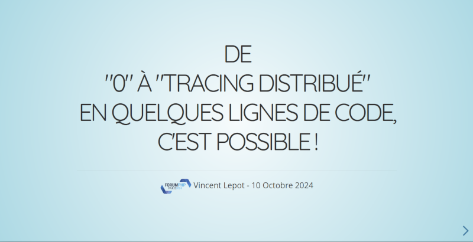

J'ai eu la chance de pouvoir présenter au [Forum PHP 2024](https://event.afup.org/forum-php-2024/) un sujet qui me tient à coeur&nbsp;: le tracing distribué avec OpenTelemetry (spécifiquement en PHP compte tenu du public).

Quand il s'est agit de faire un choix sur l'outil à utiliser pour faire mes slides, je me suis dit que le faire avec un outil propriétaire n'était pas forcément un bon choix quand on parle d'open-source (exit donc M$ Powerpoint et Google Slides). Comme l'idée est de les partager largement ensuite, je me suis dit qu'il serait plus pratique d'avoir quelque chose qui soit facilement consultable avec un navigateur internet (exit donc LibreOffice).

# Entre ici, revealjs&nbsp;! Toi et ton cortège de features

En cherchant un peu ce qui se fait, je tombe sur la librairie [Reveal.js](https://revealjs.com/).

Au début, j'étais parti pour le faire avec le convertisseur Markdown pour se faire la présentation assez vite.

Ca marche plutôt bien, mais j'ai rapidement eu envie de rajouter des animtions dans mes slides pour&nbsp;:
* afficher le texte ou les éléments progressivement
* faire de vrais animations pour appuyer la logique de certaines transitions de slides.

Et même pour un développeur aussi doué que moi en Frontend (si on compte les points en négatif évidemment 😅), c'est assez facile de décrire en HTML les éléments que l'on veut animer :

* pour afficher des éléments progressivement, une simple classe CSS suffit
* pour des animations plus complexes, il suffit de faire les slides avant et après, d'indiquer quelle forme de la slide "avant" correspond à quelle forme de la slide "après" et le framework fait le boulot de transition tout seul !

Le résultat est vraiment pas mal pour selon que ce n'est pas long à mettre en place.

# Le résultat

Autre avantage de faire ses slides en HTML/JS&nbsp;: on peut facilement les versionner et les publier sur GitHub pages 😉

* [Les slides de ma présentation](https://zibok.github.io/slides-opentelemetry-forumphp2024/)
* [Le code source](https://github.com/zibok/slides-opentelemetry-forumphp2024)

# Crédit photo

La photo de la bannière est de [Loïc Doubinine](https://blog.ztec.fr)