Comme chaque année, le monde de l'open-source et du logiciel libre se retrouve à Bruxelles pour un week-end de conférences et de rencontres.

Bières, frites et talks techniques sont au programme de ces deux jours, plus de 70 tracks sur des sujets aussi variés que des langages (Go, Javascript, Rust, Python,...), des domaines d'intéret publiques (Transports publics, data analytics, monitoring,...), des outils (LibreOffice, GIMP, Postgresql,...) et des keynotes sur des domaines plus larges parfois.

Je vous propose un retour sur l'infime partie des talks auxquels j'ai eu la chance d'assister cette année.

# FOSDEM 2025 - Jour 1, c'est parti !

## The state of Go - Maartje Eyskens

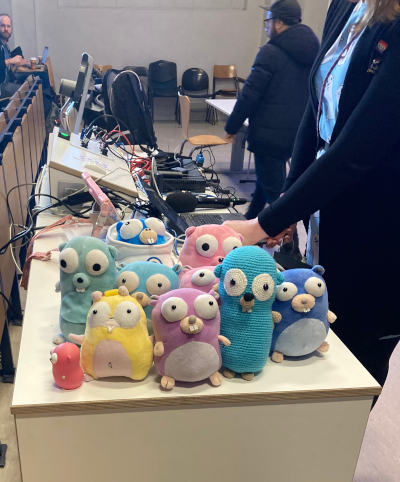

Comme l'accoutumée, en commence dans la devroom Go avec les dernières nouvelles du langage et de la communauté. Maartje arbore sa désormais célèbre robe aux gophers. On est en terrain connu.

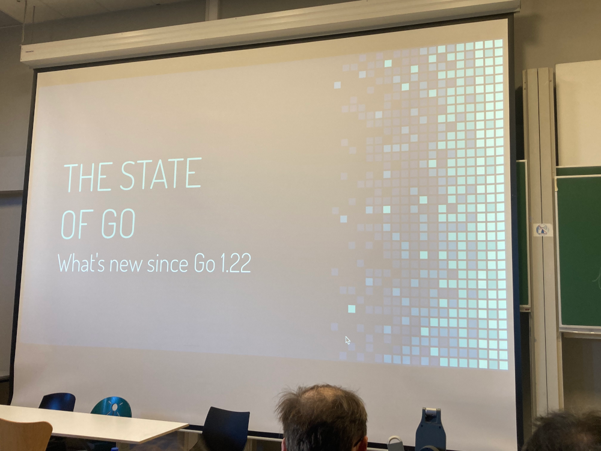

Quelques changements en Go 1.23 et 1.24

* Améliorations de range avec des itérateurs (package `iter`)
* Generic type aliases
* Nouveaux warnings dans `go vet`
* Le tooling Go gère un retour en JSON \o/ (notamment `go test`)
* Gestion de la version du binaire à partir du VCS (notamment à partir des tags Git). Plus besoin de tricks druidiques pour faire ça.
* Evidemment des fonctions d'itérations (think `iter`) dans les packages `slices` et `maps`
* `OpenRoot` pour limiter l'accès au filesystem et éviter de remonter à la racine par erreur
* Arrivée des Swiss maps en 1.24 pour que les maps soient plus performants.

Pour le futur :
* Travail en cours sur les memory regions (pour avoir plus le contrôle sur la gestion de la mémoire)

Pour ce qui est de la communauté:
* Relativement stable par rapport à l'an dernier

## The Inner Workings of Go Generics - Anton Sankov

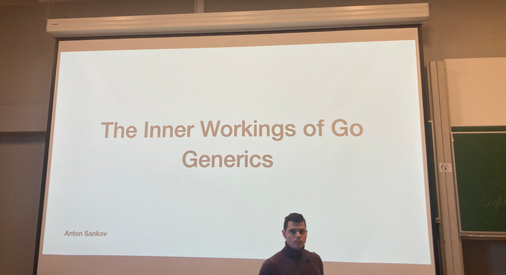

Après un peu d'histoire sur l'arrivée (très attendue) des génériques, Anton revient sur les 3 propositions d'implémentations (2 rejetées - avec les raisons - et celle effectivement implémentée - qui combinent les 2 premières :D )

Il finit par les risques en terme de performance à utiliser les génériques.

Super intéressant à garder en tête quand on utilise les génériques (ils sont très utiles mais à user avec parcimonie).

## Swiss maps - Bryan Boreham

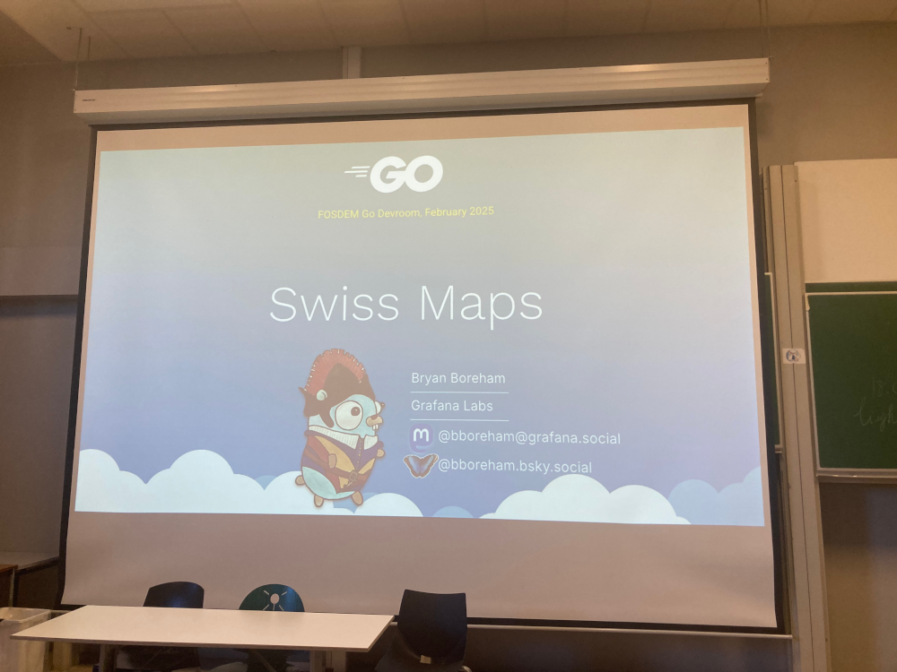

Un talk à propos de ~la nouvelle carte de la Suisse~ la nouvelle implémentation des maps en Go 1.24.

Très prometteur (même si le speaker avoue qu'il n'a pas vu de gain sur Prometheus - projet sur lequel il travaille :sweat:).

Il introduit aussi la notion de SIMD (_Single instruction multiple data_), qui permet d'accélérer encore cette implémentation pour l'architecture amd64.

Cependant, cette nouvelle implémentation introduit du breaking pour les librairies qui s'appuient sur l'implémentation go 1.23, donc une couche de compatibilité va être ajoutée (ce qui repousse la release 1.24 d'une petite semaine).

## Privilege Separation In Go - Alvar Penning

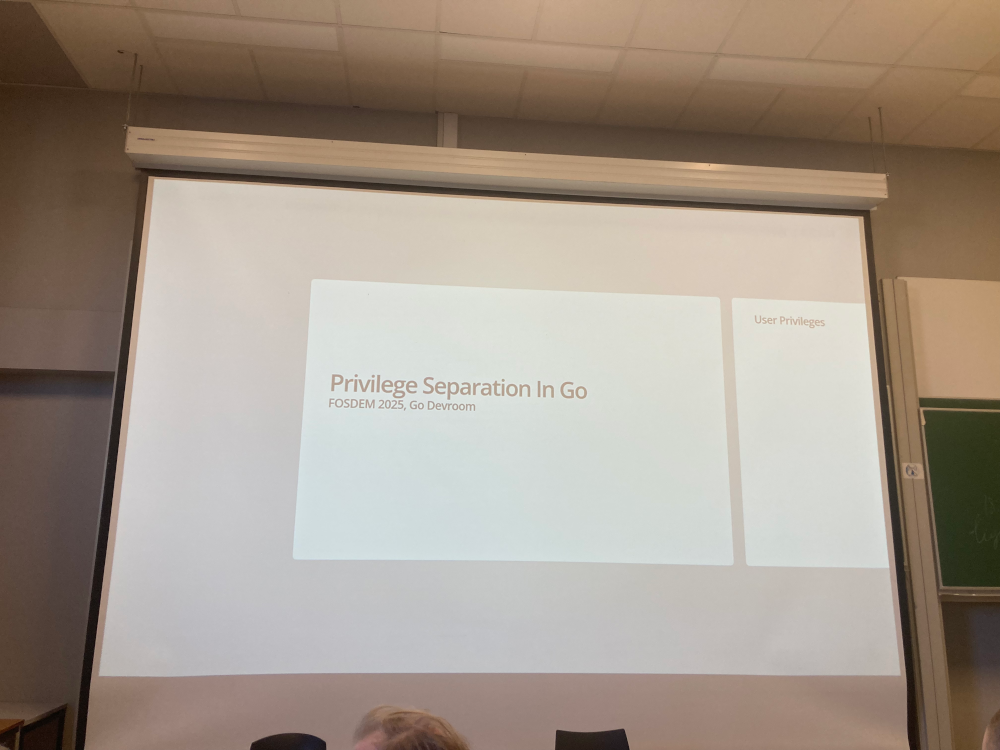

Un talk intéressant sur une manière de séparer les privilèges en fonction de partie d'une fonctionnalité, principalment en s'appuyant sur POSIX, landlock (Linux seulement). Son principal argument est d'utiliser des process différents avec des privilèges différents.

Très intéressant, et très riche. Je me le reverrai à tête reposée plus tard.

## Go-ing Easy on Memory: Writing GC-Friendly code - Sümer Cip

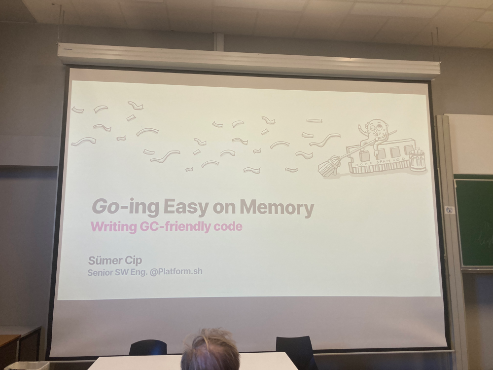

Ou comment écrire du code qui tient compte du Garbage collector du langage.

## The Selfish Contributor Revisited - James Bottomley

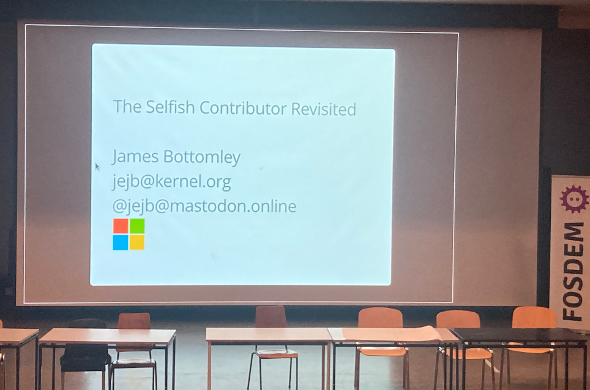

Partant du postulat que les ingénieurs sont plus efficace quand ils font des choses qu'ils aiment, James nous explique que c'est ce vecteur dû au côté égoïste des developpeurs qu'on obtient le plus de résultats en open-source.

Ex : Linus Torvalds qui a créé Linux pour lui (mais l'a fait en gratuit)

Les communautés se créent naturellement car c'est un truc d'humain. Et elles sont d'autant plus riches qu'elles ont de la diversité de pensée et donc souvent... de la diversité tout court.

Comment doit être le leadership d'une communauté pour la faire grandir correctement ? Quels sont les comportements topiques à éviter ? Quels conseils pour quelqu'un qui veut faire grandir sa communauté ? James nous donne un talk avec ses opinions sur ce sujet.

## 14 Years of systemd - Lennart Poettering

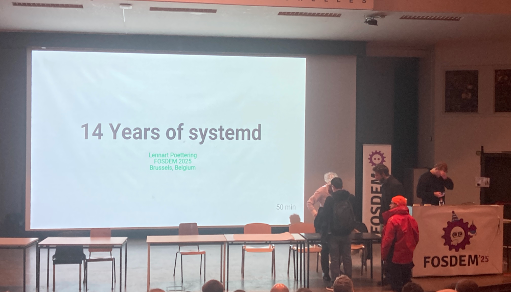

Lennart revient sur l'histoire de Systemd, ses prédécesseurs, les choses qu'il essayait de régler.
Mais aussi, est-ce que systemd est Unix ? Oui et non
Est-ce que c'est Linux ? pas vraiment
Est-ce que c'est lourd ? pas vraiment, mais c'est pas léger

Puis quelques insights sur les choix d'architecture.
* Modularité 
* Weak dependencies (en utilisant à fond `dlopen()`)
* Seul le service manager est nécessaire, le reste peut ne pas être utilisé

Systemd, ce sont aussi des standards enforcé (ndlr: donc très opinionated) et aussi des standard "consommés" (comme l'utilisation du standard UEFI GPT dans certaines parties).

Pour le futur ?
* Aller plus loin dans l'intégration avec le Boot
* Revoir le fonctionnement des communications inter-process (avec Varlink)
* Réécriture en Rust ? Pas simple car supposerait de faire du link statiques des libraires et donc augmenter drastiquement l'empreinte des 150 binaires

# C'est tout pour aujourd'hui...

... mais ça continue demain. En attendant, quelques photos d'ambiance et du régime du Fosdémien.

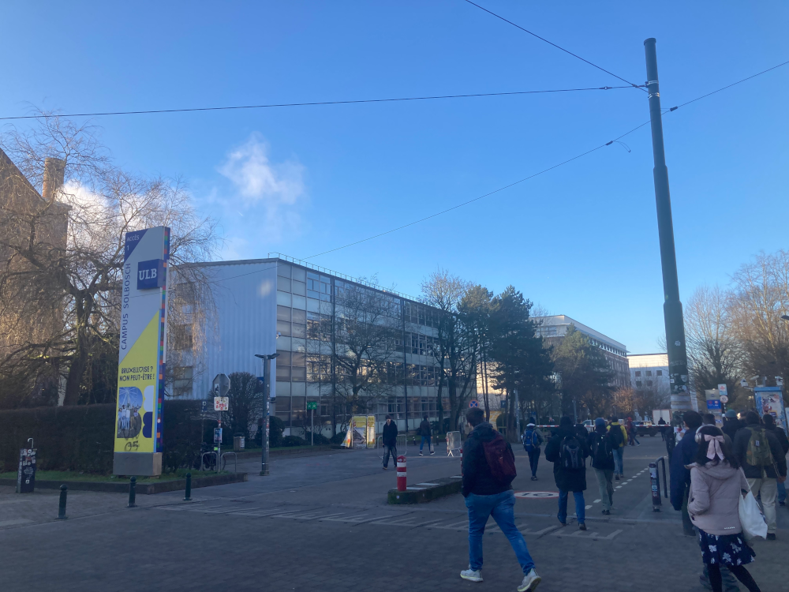
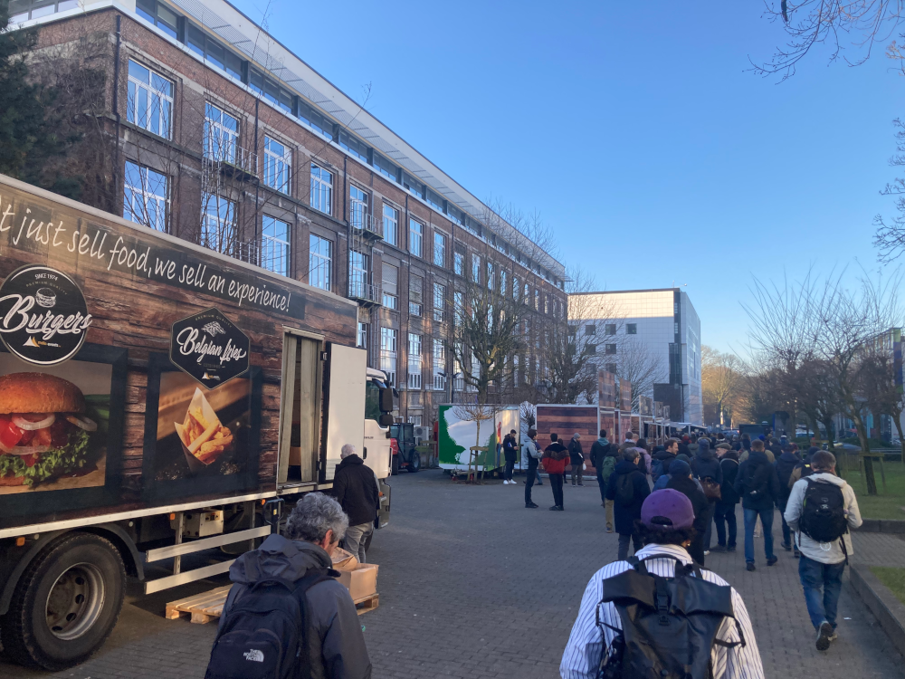
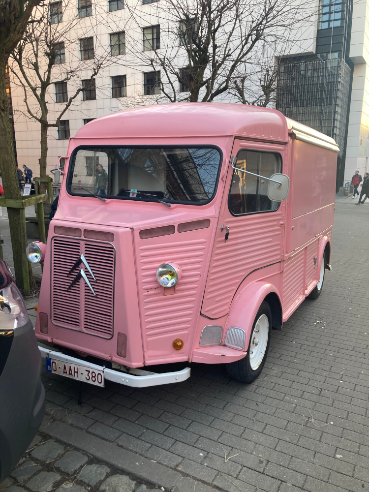
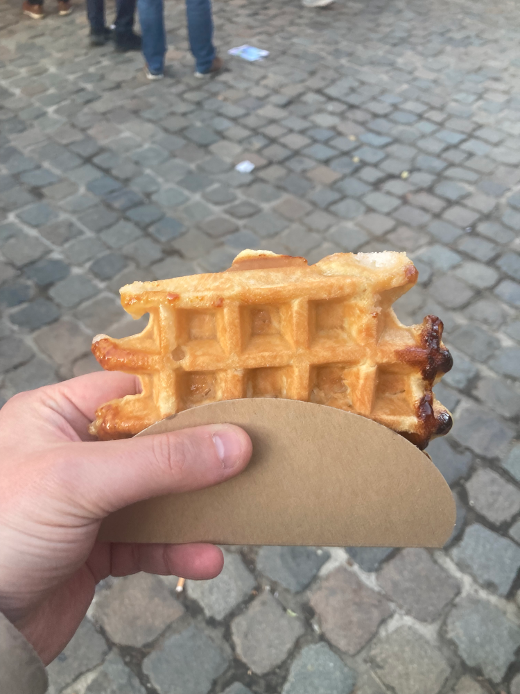
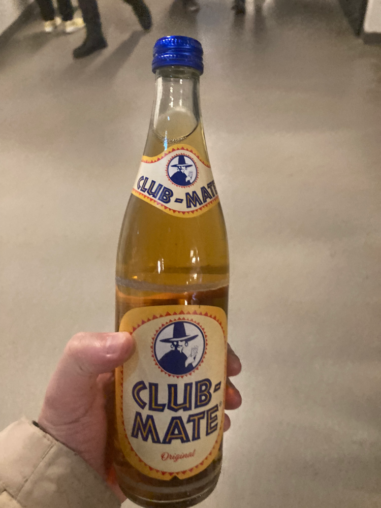