Cet article fait partie d'une série d'articles concernant le FOSDEM 2025.
* [Jour 1]()
* Jour 2 (Vous êtes ici ! 🎯)

On a bien mangé et bien bu, on a la peau du ventre bien tendue... et on a de l'énergie pour reprendre notre cycle de conférence.

Alors on n'attend pas, pas d'intro à rallonge (on me dit "trop tard" dans l'oreillette), et c'est parti pour le jour 2/2 du Fosdem 2025

# Monitoring & observabilité

Ce matin, nous commençons par quelques talks de la room Montoring & Observability, où ça risque très fort de parler d'OpenTelemetry ;)

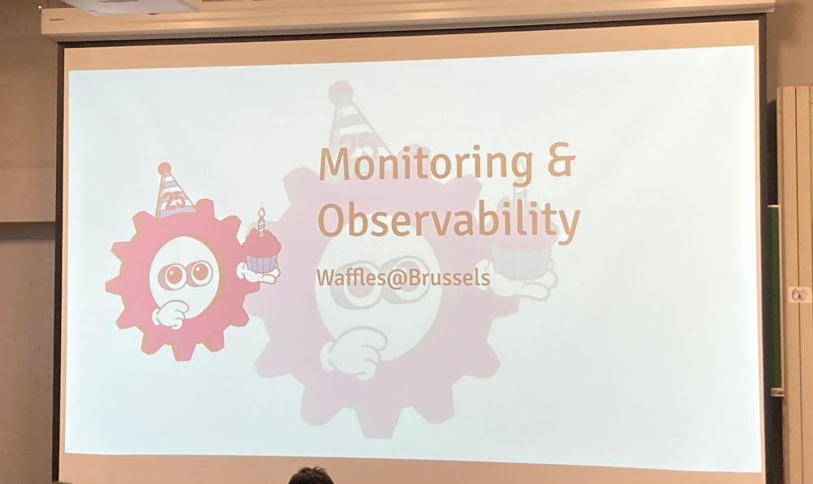

## [Discovering the Magic Behind OpenTelemetry Instrumentation - Jose Gomez-Selles](https://fosdem.org/2025/schedule/event/fosdem-2025-4146-discovering-the-magic-behind-opentelemetry-instrumentation/)

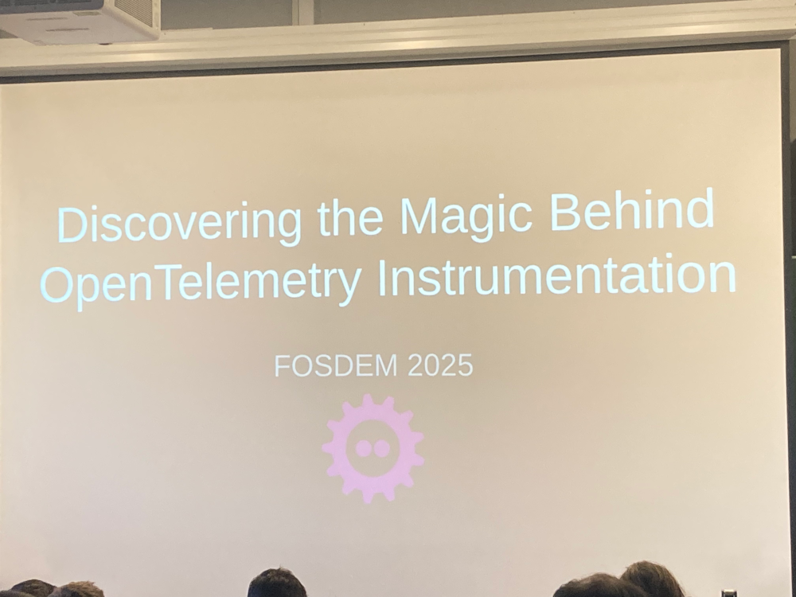

José va se concentrer sur l'instrumentation manuelle d'une codebase.

Il insiste sur la distinction entre API (utilisée par les développeurs) et le SDK (qui donne les implémentations de cette API en fonction du contexte dans lequel tourne l'application). Il revient sur le fonctionnement des métriques, des traces et des logs.

Le code est en C++ donc est un peu verbeux, mais très intéressant comme intro.

## [Apache Flink and Prometheus: better together to improve the efficiency of your observability platform at scale - Lorenzo Nicora, Hong Teoh](https://fosdem.org/2025/schedule/event/fosdem-2025-5726-apache-flink-and-prometheus-better-together-to-improve-the-efficiency-of-your-observability-platform-at-scale/)

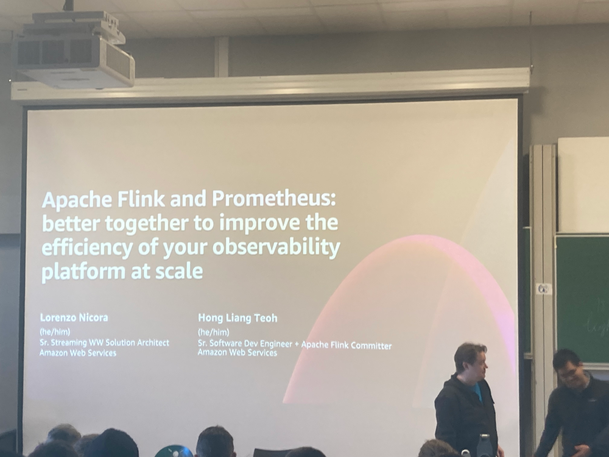

Le use-case ici est : comment fait-on pour monitorer des devices qui seraient un peu partout dans la nature (par exemple, IoT, voitures,..). Pas possible de faire du pulling model avec Prometheus, et donc comment fait-on du push ? De plus, on se retrouve avec potentiellement des cardinalités de malade. Or on sait que Prometheus ne gère pas bien les grandes cardinalités.

L'idée est donc de faire du pre-processing, et c'est là que Flink entre dans la danse.

Flink est un framework qui permet de faire de la transformation sur des streams de données. Jusqu'à peu, il n'y avait pas de connectors pour envoyer des données dans Prometheus... mais maintenant c'est le cas avec la Prometheus Sink pour Apache Flink.

Cela permet :
* de réduire la cardinalité des métriques
* de gérer des fréquences de réception de mesures (qui peuvent être très importantes dans l'IoT par exemple) 
* d'enrichir les données avec des informations que l'on n'a pas dans la trame d'origine (via des infos en base de données par exemple)

Ca peut être inspirant. (A voir si ça peut être fait avec Kafka Connect ou Spark streaming aussi)

## [Prometheus Version 3 - Jan Fajerski, Bryan Boreham](https://fosdem.org/2025/schedule/event/fosdem-2025-6571-prometheus-version-3/)

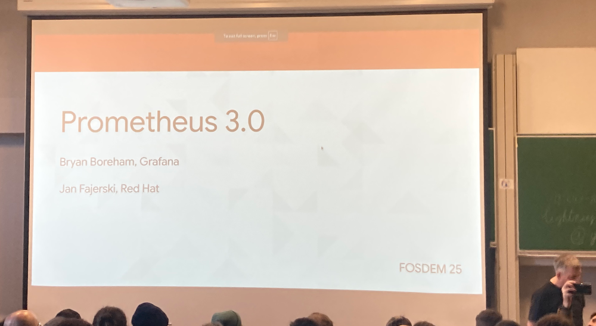

Pas mal de nouveautés, notamment l'ingestion d'otlp directement, remote writes v2, quelques changements pour améliorer les perfs de PromQL. Pas sûr de l'essayer tout de suite mais intéressant.

## [The performance impact of auto-instrumentation - James Belchamber](https://fosdem.org/2025/schedule/event/fosdem-2025-5502-the-performance-impact-of-auto-instrumentation/)

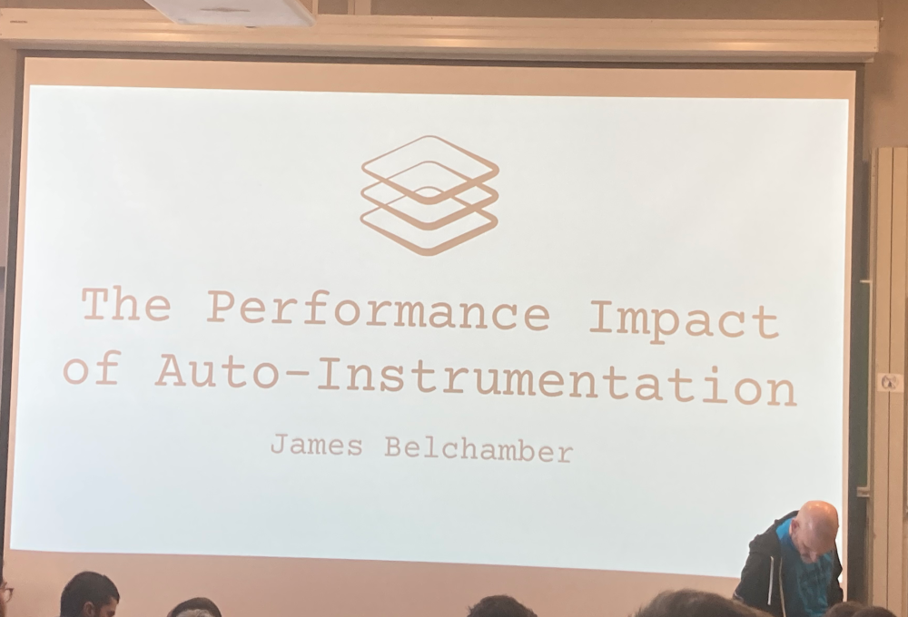

L'instrumentation prend des ressources et impacte les performances, mais pas tant que ça (en tout cas sur des applications très simple en Java et en Go).

Sur de vrais applications, l'impact est souvent négligeables en performance (mais ça commence plus de mémoire).

Après, il faut faire ses benchmarks (car selon le langage, c'est pas toujours vrai).

## [Zero-Code Distributed Traces for any programming language - Fabian Stäber, Rafael Roquetto](https://fosdem.org/2025/schedule/event/fosdem-2025-5028-zero-code-distributed-traces-for-any-programming-language/)

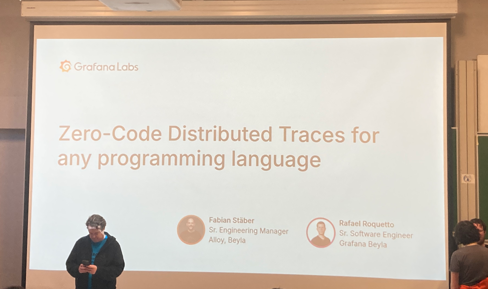

L'histoire intéressante de comment Grafana Beyla arrive à injecter le trace ID parent dans les requêtes http sortantes d'un process. Une histoire de "comment on trompe le kernel Linux dans sa gestion des paquets réseau pour faire de l'injection d'information ?"

Pour l'instant ça ne marche qu'en http 1.x, mais c'est un gros challenge.

# Main track

## [Was Leslie Lamport Right? - Sarah Christoff, Nic Jackson](https://fosdem.org/2025/schedule/event/fosdem-2025-4941-was-leslie-lamport-right-/)

A partir de l'histoire de l'empire byzantin, on arrive au problème dit "des 2 généraux" (à propos de la gestion de consensus). Pour arriver au consensus, Leslie Lamport a énoncé que le problème était résolu si on a `3m + 1` généraux pour arriver à un consensus et avec `t + 1` tours de vote (`t` étant le nombre de traitres).

Un talk qui résente des algotrithmes de solutions pour la consistence, la concurrence, la fiabilité,...

Difficile à suivre de là où j'étais (le son en Janson n'est vraiment pas ouf), je le reverrai peut-être plus tard en replay.

# [The Growing Body of Proprietary Infrastructure for FOSS Development: Repeating Bad History - Karen Sandler, Bradley M. Kuhn, Denver Gingerich](https://fosdem.org/2025/schedule/event/fosdem-2025-6153-the-growing-body-of-proprietary-infrastructure-for-foss-development-repeating-bad-history/)

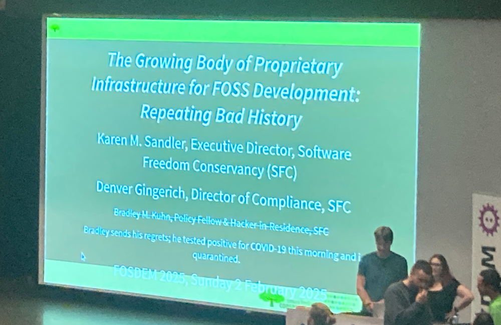

L'histoire a des hoquets.

On part de Sourceforge qui hébergeait la plupart des projets open-source au début des années 2000. Puis ils ont voulu faire de l'argent... et ça s'est cassé la figure car tout le monde est parti.

Tout le talk tourne autour des licences libres et du respect de la créativité. (Copyleft, GPL,...) vs MIT qui est ultra permissive et peut dépouiller les créateurs de leurs droits.

Le message principal : quittons Github ! (Evidemment plus facile à dire qu'à faire).

On notera que les 2 speakers ont dû reprendre au pied levé cette conférence car le présentateur original a dû se mettre en quarantaine après avoir été testé positif au COVID-19... le matin-même.

# Aaaaaaand... that's all folks!

Ce fut un week-end rempli de talks intéressants comme chaque année, de discussions autour d'une bière, de brouhaha dans les amphis pendant les Q&A (ça on s'en passerait bien mais bon...).

Bref hâte de revenir l'an prochain.

On finit avec quelques photos et à bientôt

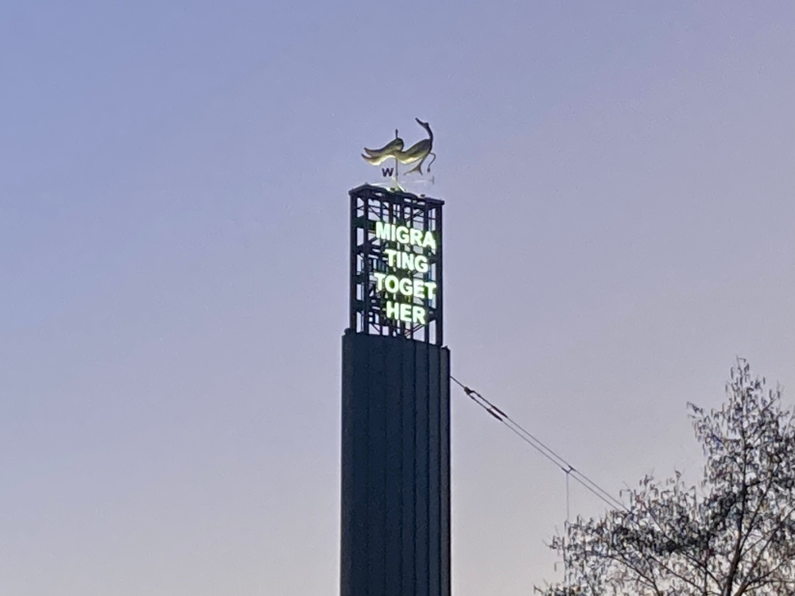
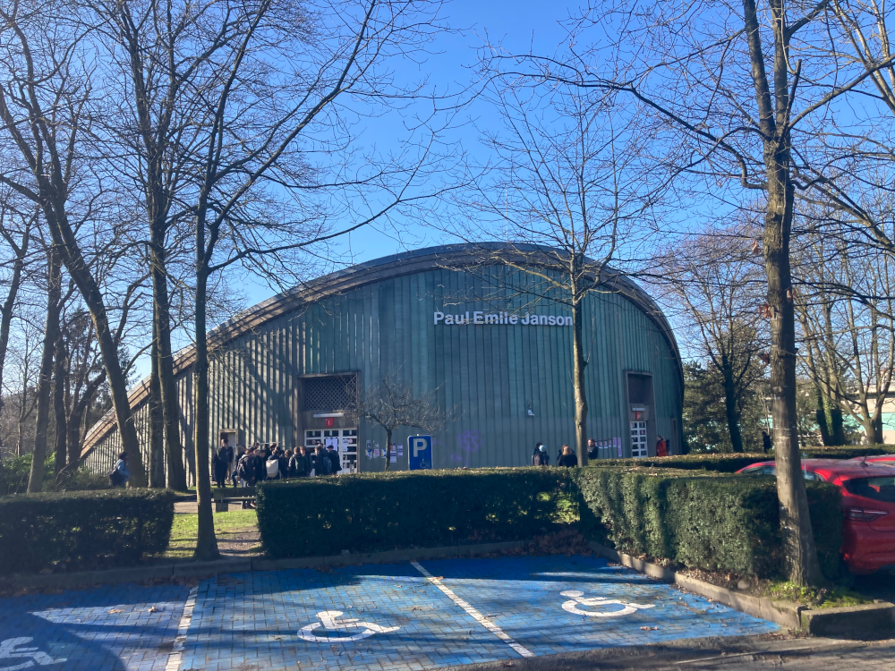
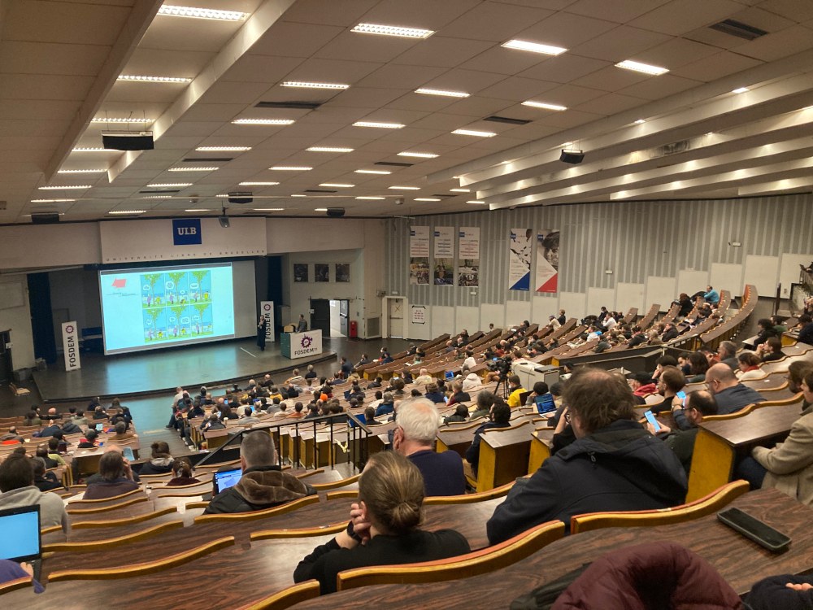
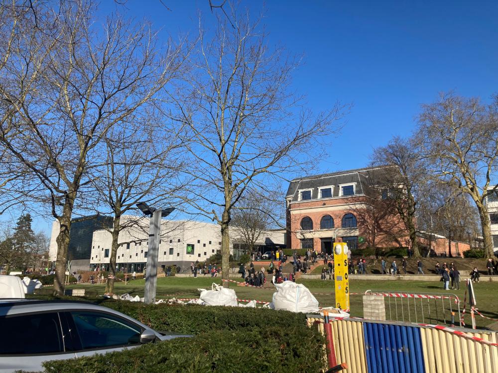
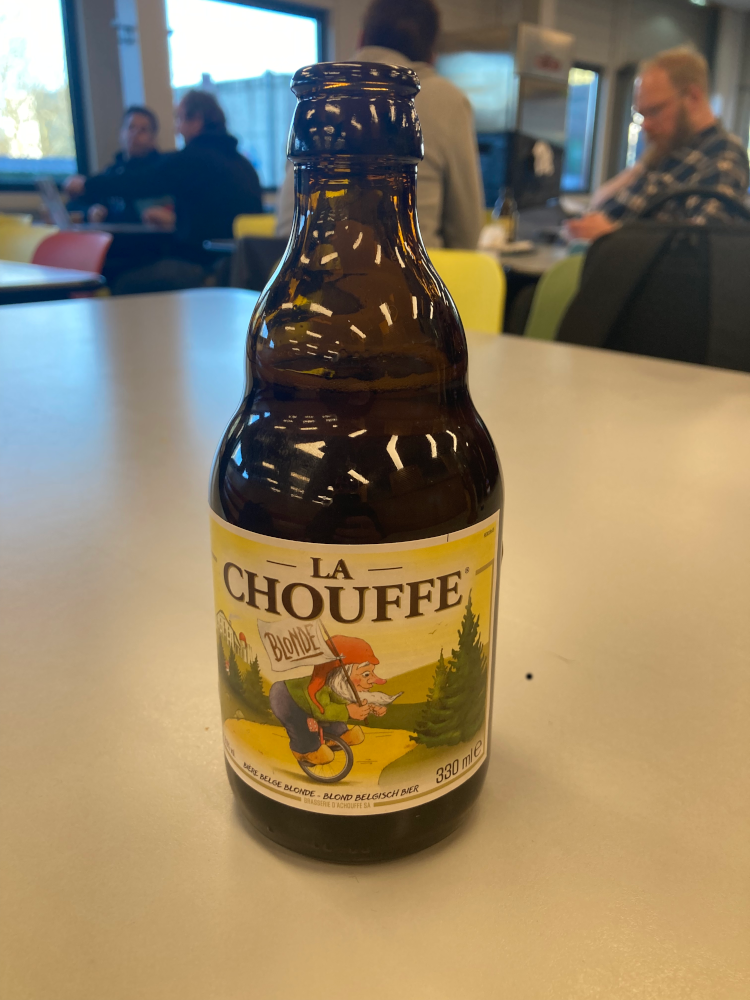