Cet article fait partie d'une série d'articles concernant le FOSDEM 2026.
* [Jour 1]()
* [Jour 2]()
* BONUS (Vous êtes ici ! 🎯)

Histoire de vous donner une idée de l'ambiance, quelques photos de l'ULB et du régime du participant au FOSDEM.

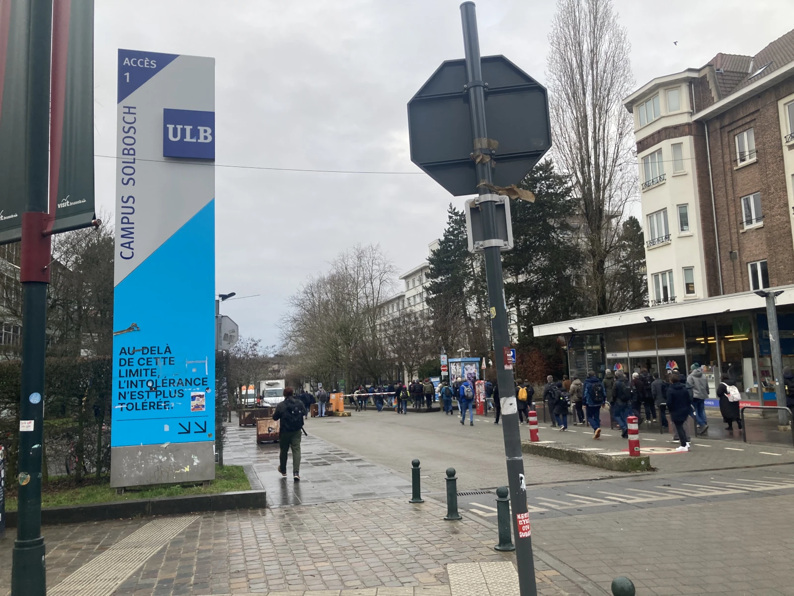
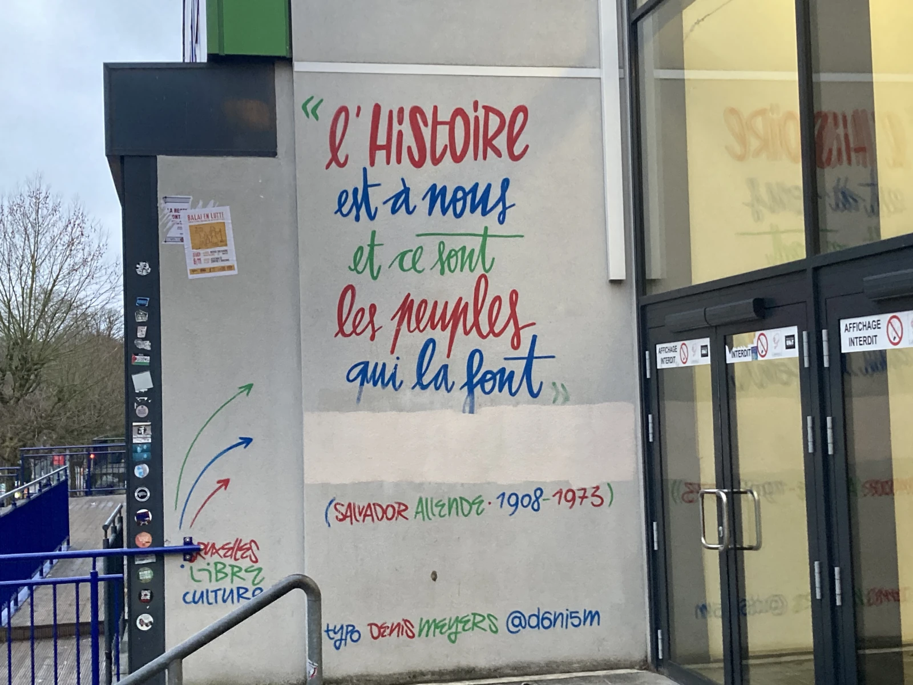

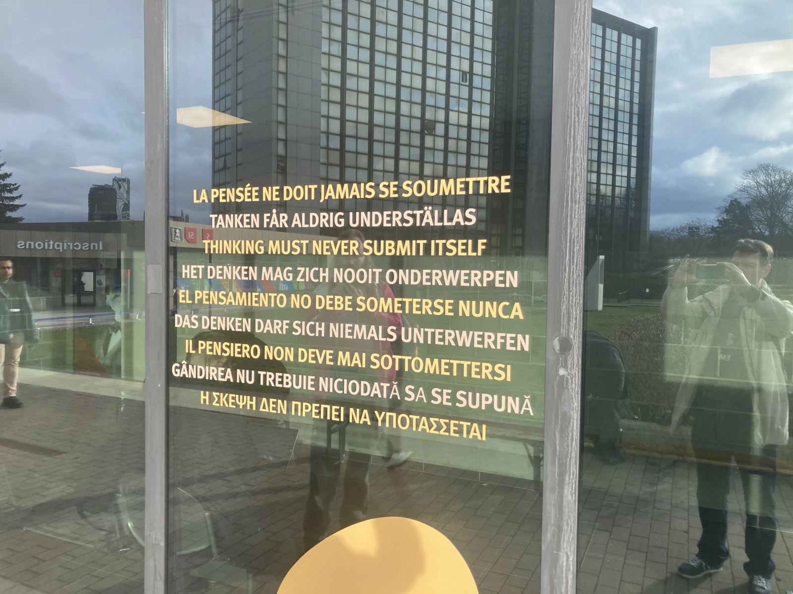
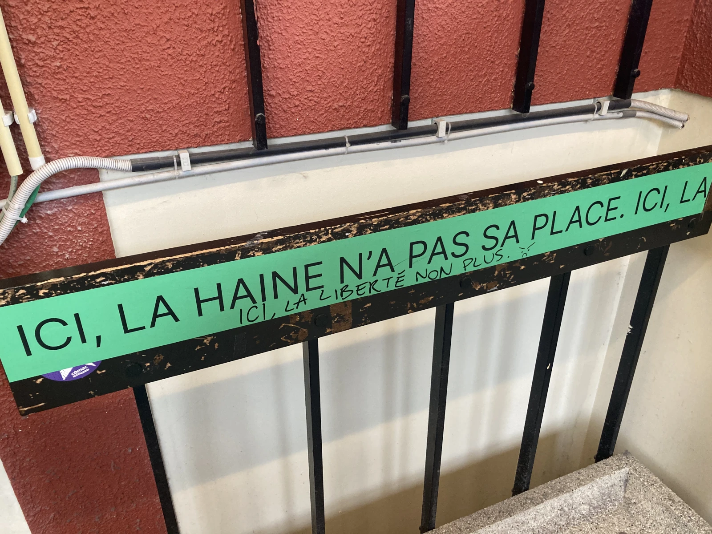
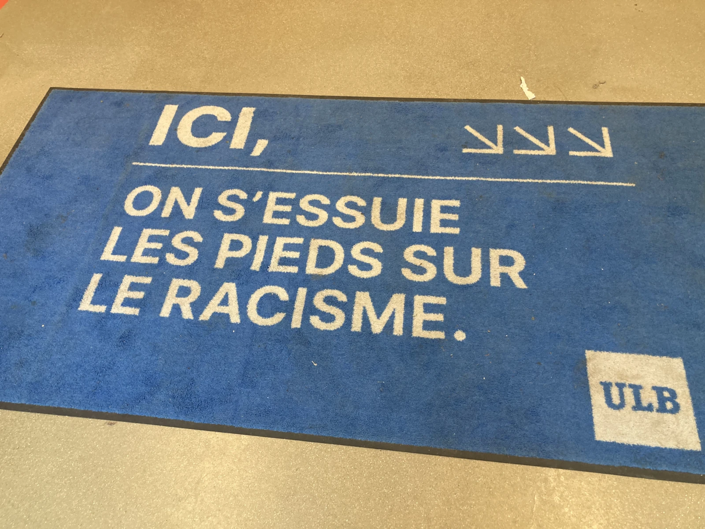

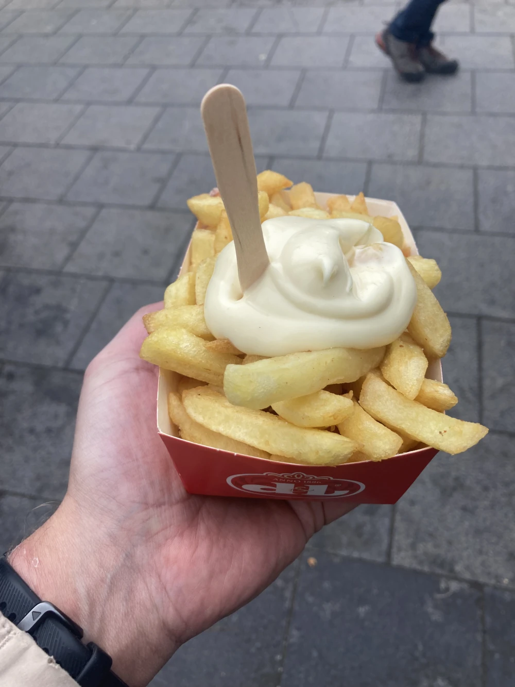
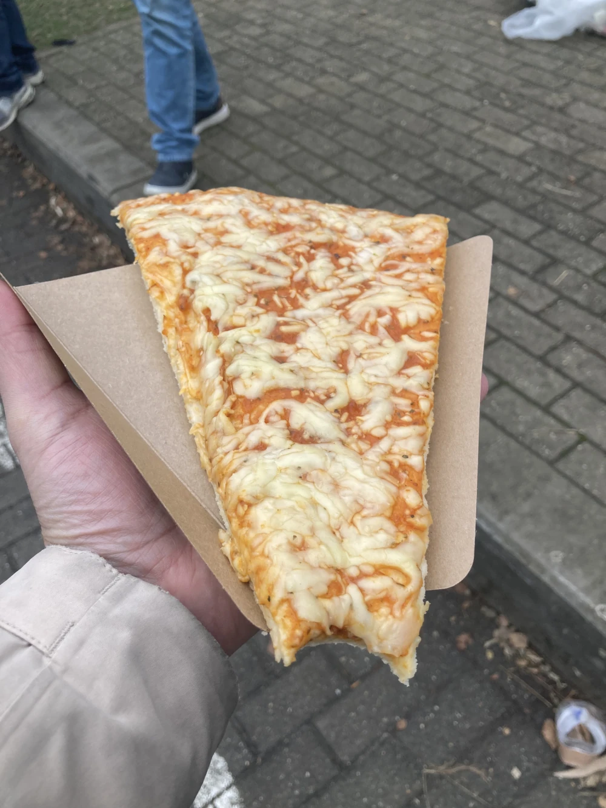
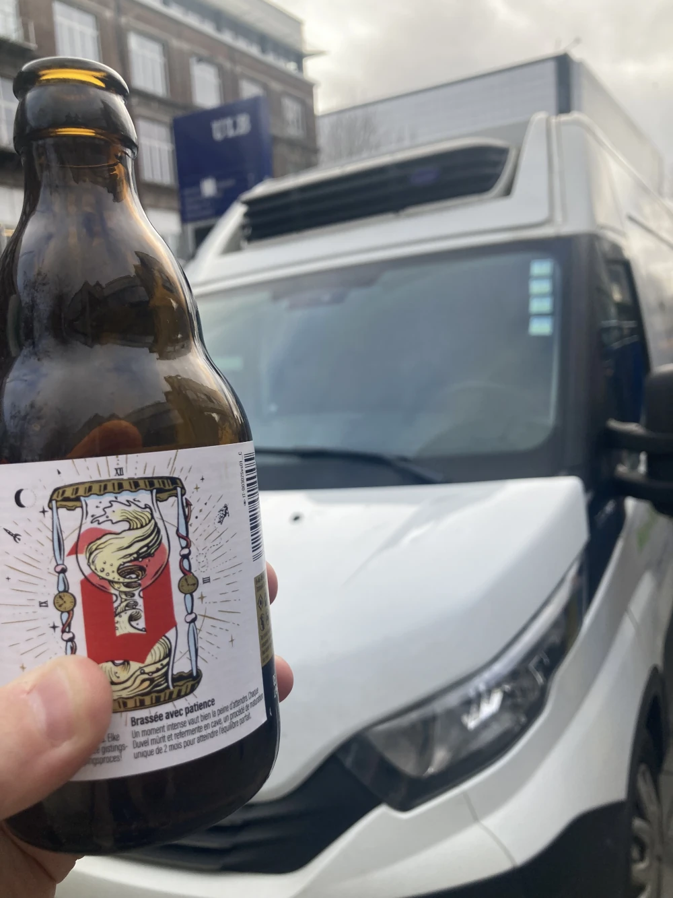
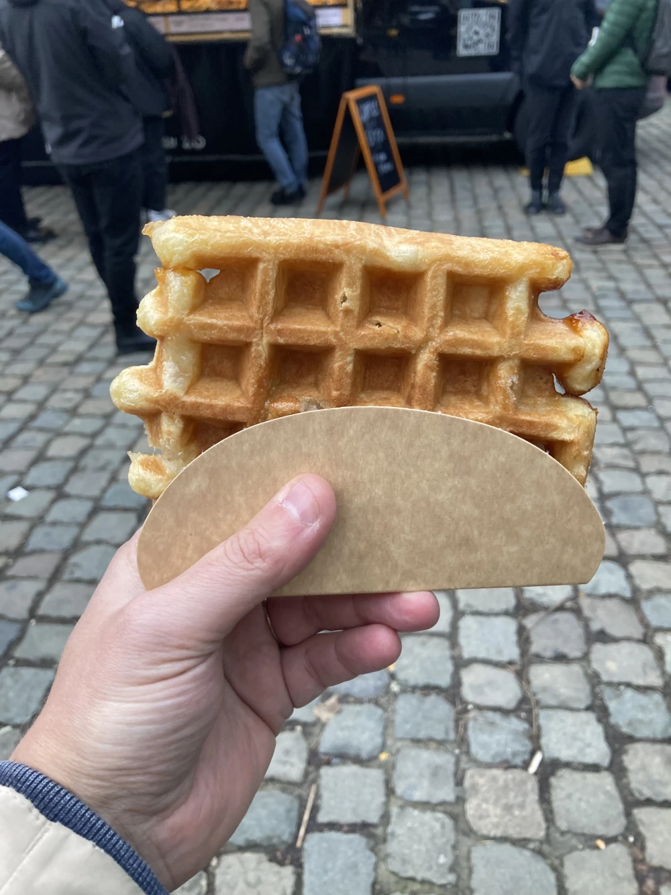

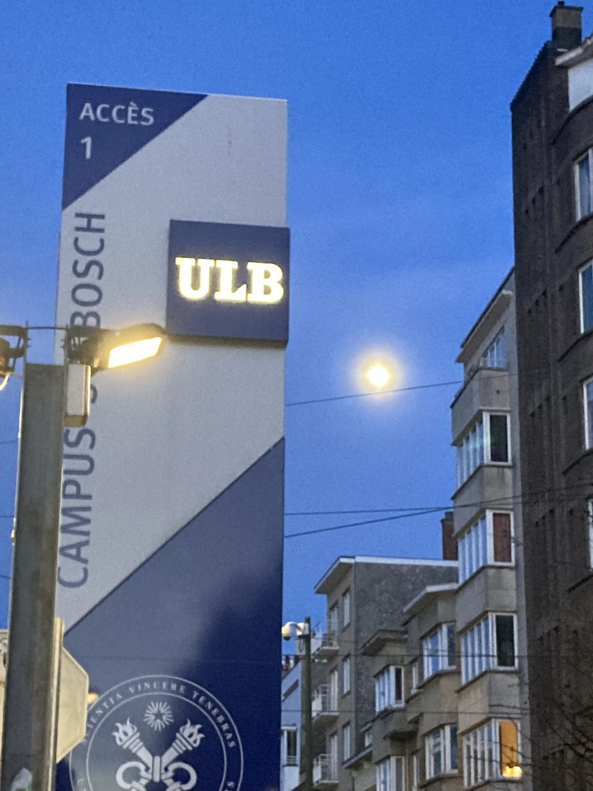
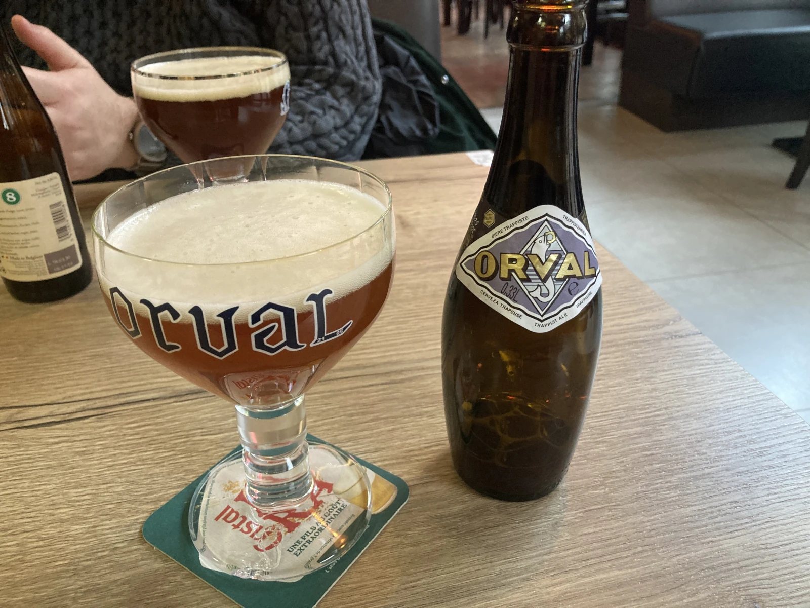
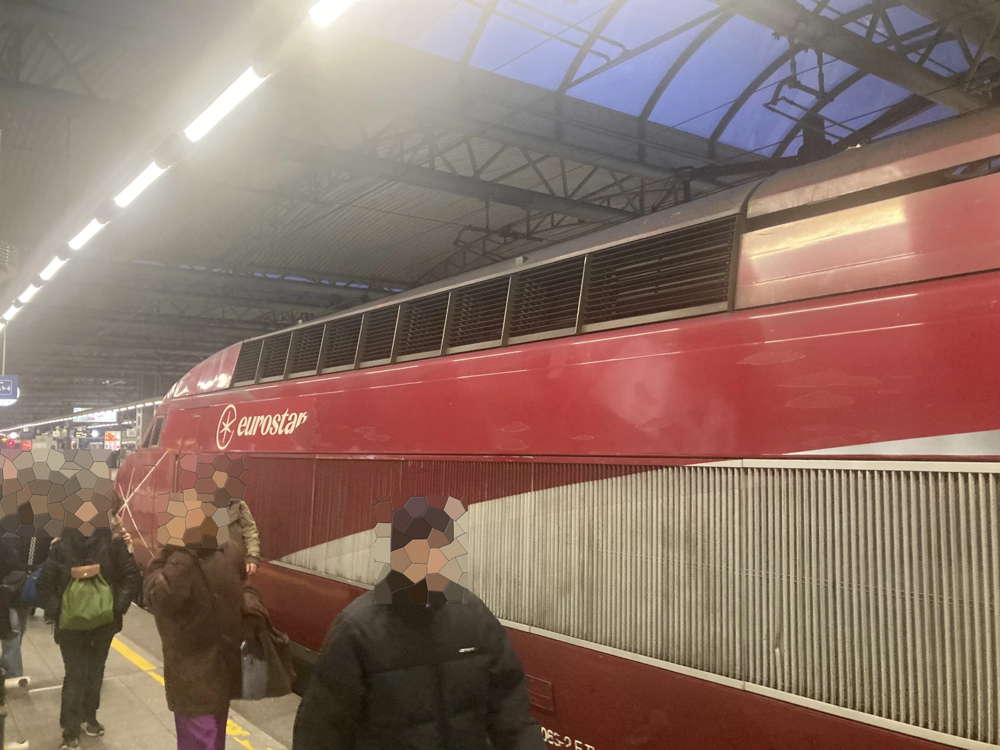
